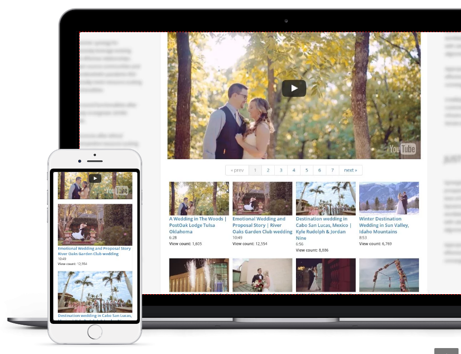

import {Button,List} from 'semantic-ui-react';

TubePress makes it easy to add responsive video galleries to your website.
It's highly configurable and designed for website builders and users of any skill level.

## Live Demo

You can interact with a live demo of TubePress hosted on our website.

<a href="https://tubepress.com/demo/" target="_blank">
    <Button primary>
        Check it out
    </Button>
</a>

## Why is this useful?

A curated video library on a website can entertain, educate, and engage visitors like no other medium. TubePress empowers website owners to enrich their sites with beautiful, interactive video galleries. You can embed video libraries of any size into any website. Simply select a source of the videos, then customize the look and behavior of the resulting gallery.

**This is very different than embedding a single video to your website.** That's easy; all major video hosts allow anyone to copy-paste a snippet of HTML to embed a single video player. But adding a gallery of videos is a surprisingly difficult technical challenge. TubePress handles all the heavy lifting and dirty work on your behalf, freeing you to focus on the content of your website instead of its mechanics.

## How it Works

You create a gallery by telling TubePress:

* the sources of your videos (e.g. a YouTube playlist, or uploads from a Vimeo user)

* the look and behavior of the resulting gallery

* where on the page that you want your gallery to appear

That's it! TubePress will fetch the videos from the host and display them on your site. The software will monitor your video sources for updates (new videos, deletions, edits, etc.) and automatically reflect any changes on your website. You can add unlimited galleries to your site, each configured independently from the next.

## Video Sources
TubePress can work with videos hosted on YouTube, Dailymotion, or Vimeo. We are actively working on adding more video hosts. We do not support self-hosted videos as there are increasingly few reasons to do so; by hosting your videos with the "big guys," you can take advantage of better bandwidth and an always-updated video player that works across all devices.

For each video host, **TubePress can read from any of the twenty-four individual sources listed below**. For each source, you can control the sort order of the videos (e.g. newest first, most-viewed first, etc.).

---

#### YouTube    
* a YouTube playlist
* favorite videos for a given user/channel
* videos matching a search term
* videos uploaded to a specified channel
* a comma-separated list of YouTube video IDs that you'd like to display
* videos related to a YouTube video

---

#### Vimeo    
* videos uploaded by a Vimeo user
* a Vimeo album
* a Vimeo category
* a Vimeo channel
* a Vimeo group
* videos matching a search term
* videos tagged with a term
* videos in which a given Vimeo user appears
* "likes" for a Vimeo user

---

#### Dailymotion    
* favorites for a Dailymotion user
* videos from a user that have been "featured" by Dailymotion
* a comma-separated list of Dailymotion video IDs
* a Dailymotion playlist
* videos related to a Dailymotion video
* videos matching a search term
* videos from a user's subscriptions
* videos tagged with a given term
* videos uploaded by a Dailymotion user
