Easily add beautiful video galleries to your [Jimdo](https://www.jimdo.com/) website with TubePress. Just choose which videos you'd like to include, customize the look, and add it to your Jimdo website with a small HTML snippet. TubePress will make sure your galleries are always up to date with your latest videos.

## Sign in to TubePress Express

[Click here](https://dashboard.tubepress.com/) to log in to TubePress Express, which is our high-speed cloud-hosted TubePress service.

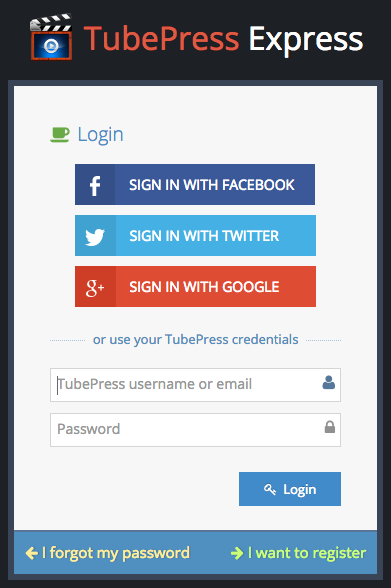

If you need to register for a TubePress account, simply click the "I want to register" link in the bottom right corner.

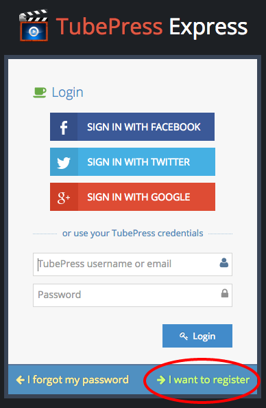

## Create a video gallery

After logging in, click the "Create your first one now" button to create your first TubePress gallery.

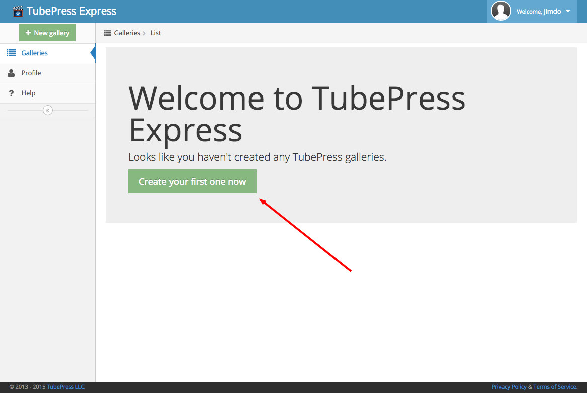
 
Follow the on-screen guides to learn how to configure your gallery just the way you want it. When you are ready to move on, just click the "Save" button.

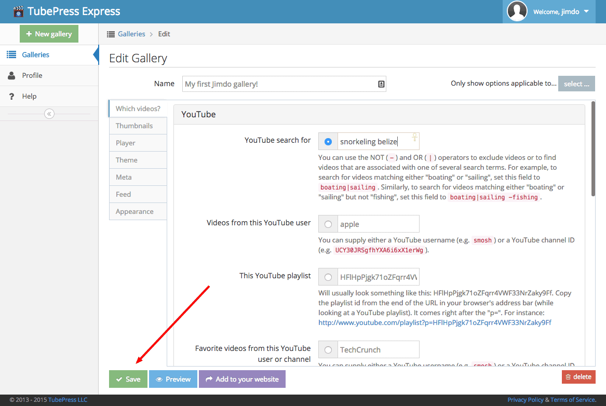

## Add video galleries to your Jimdo site
 
1. **Click "Add to your website"**

    After saving your gallery, click the "Add to your website" button that pops up.

    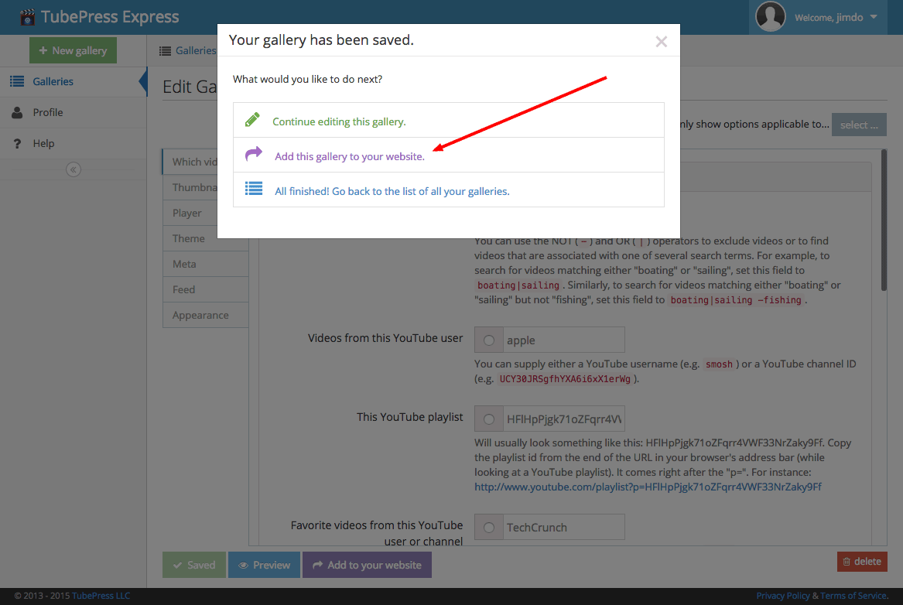
 
1. **Copy the HTML snippet to your clipboard**

    Click "Copy to clipboard" to copy your gallery's HTML snippet to your clipboard.

    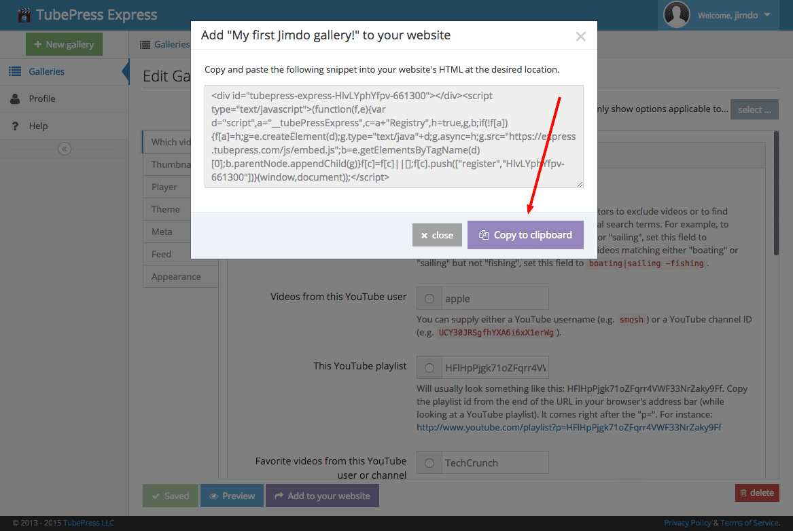
 
1. **In Jimdo, choose where you want to insert your gallery**

    Back in the Jimdo editor, find where you want to insert your video gallery and then click "Add Element".

    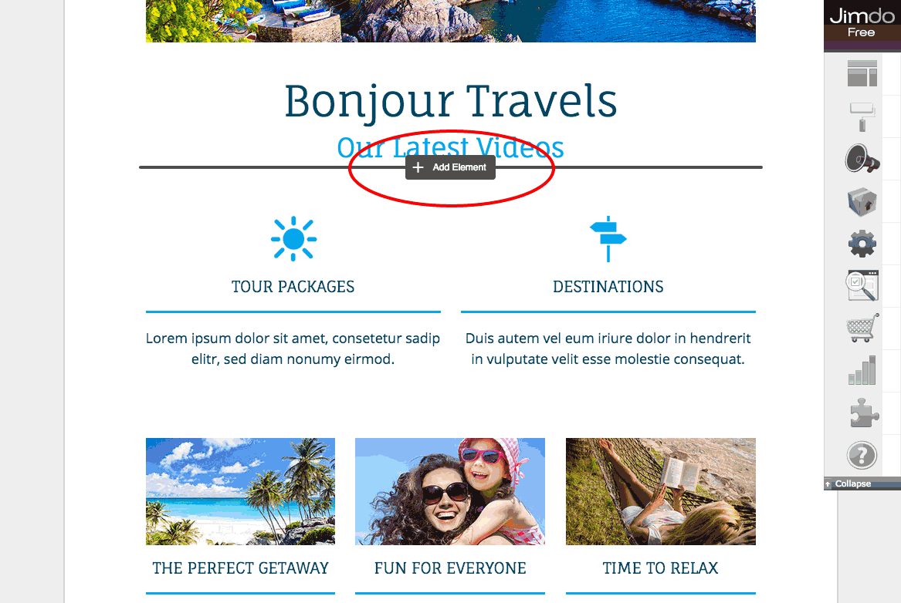

1. **Click "Additional Elements", then "Widget / HTML"**

    You'll be inserting an HTML element, so first click the "Additional Elements" button.

    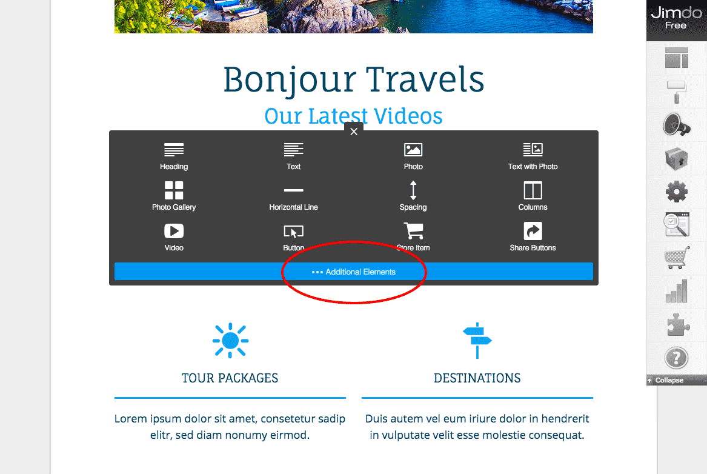
 
    Then click "Widget / HTML".

    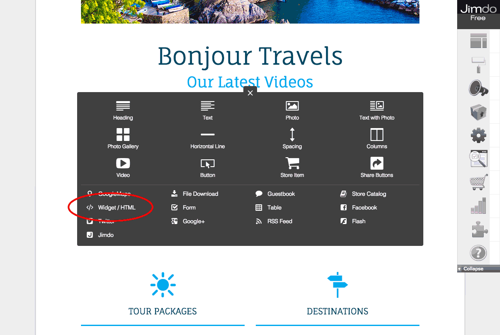

1. **Paste in the TubePress snippet**

    In the text area that comes up, paste in the HTML snippet that you copied from TubePress.

    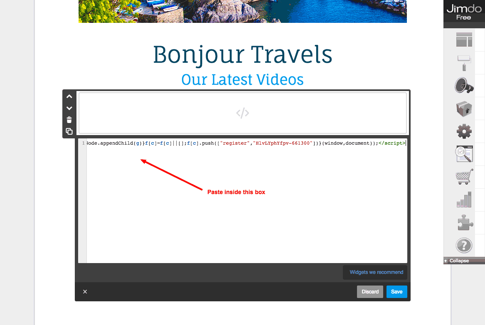
 
    Then click the "Save" button.

    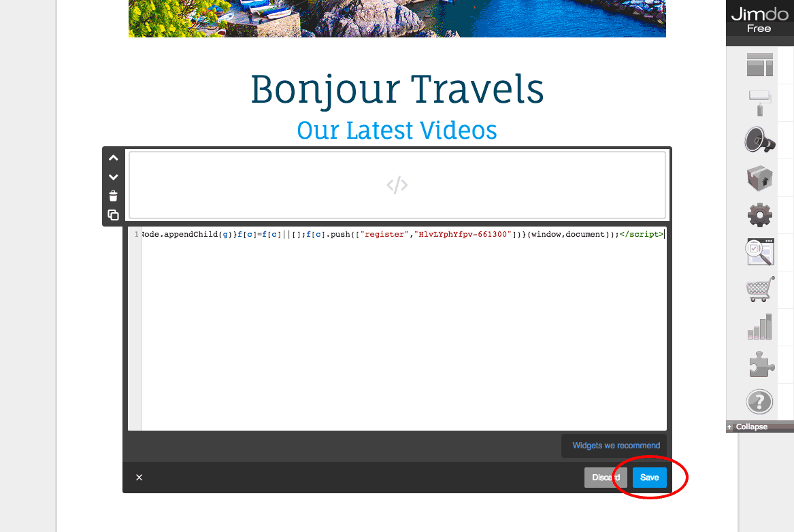
 
1. **Enjoy your new video gallery!**

    

TubePress will keep your gallery up to date with your latest videos. If you want to make any changes to the gallery, simply log in to TubePress Express and save your changes there; **there is no need to repeat these installation instructions**.
