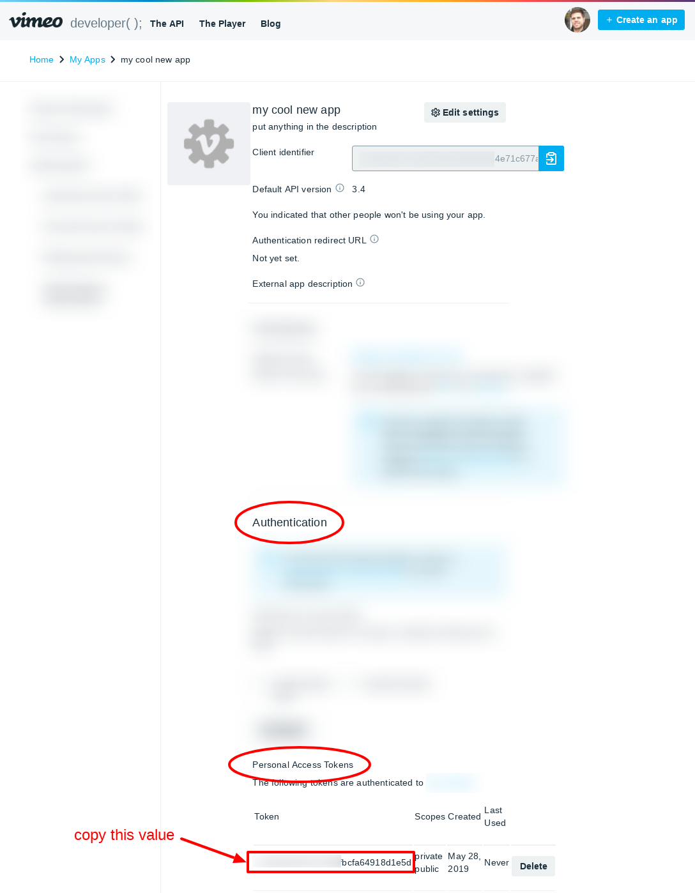

Vimeo users with a [paid Vimeo subscription](https://vimeo.com/upgrade) 
(such as Plus, Pro, Business, or Premium) are given extensive privacy controls 
over their videos. This allows you to maintain a private video collection that 
is *only* accessible on your TubePress-powered website. For additional control, 
you could place your TubePress galleries behind a paywall or password-protected 
area of your site.

The rest of this page describes the one-time setup procedure that grants TubePress
access to your private videos.

## Step 1: Adjust your video privacy settings

For each video that you’d like to hide, set its privacy settings (e.g. https://vimeo.com/235586097/settings/privacy) 
to "Hide this video from vimeo.com". This will prevent the video from showing up anywhere outside your site.

## Step 2: Create a Vimeo "API App"

1. Visit https://developer.vimeo.com/apps to view/manage your Vimeo "API Apps".

1. You may have at least one app there already. If so, go ahead and click on the app name.

    
    
    If you don’t have an app, click the "Create App" button to create a new app. You can use anything you’d like for the App Name, Description, and URL. You don’t need to bother with any of the other fields.
    
    

## Step 3: Obtain an Access Token

### WordPress users

### All other users

1. Scroll down the page and you’ll see an "Authentication" section. Ensure that you select:
 
    1. "Authenticated (you)"
    1. "Public" and "Private" scopes
    
    Then click the "Generate" button.

    

1. Vimeo will show you your new access token under the "Personal Access Tokens" section. Select and copy this token.

    

1. [Open the settings](#full-configuration) for your TubePress gallery from your Wix Website Editor. Under `All Settings > Feed tab > Vimeo`, enter your new API key in the Access Token field.

    

1. Click the "Save" button.

## Step 4: Utilize your Access Token

### WordPress users

### All other users
