TubePress "add-ons" are optional, additional software installations that add functionality to TubePress Pro. Currently, we offer 4 add-ons, described below.

Add-ons are pre-installed at no cost for TubePress Express users (including Jimdo, Weebly, and 1&1) and Wix users; you only need to purchase and install the add-on if you are using TubePress Pro.

## YouTube Black Bars Remover

Most YouTube video thumbnails have horizontal black bars on the top and bottom. This TubePress add-on completely removes these bars, leaving behind a clean and more professional image.

### Screenshots

import {
  ExpansionPanel,
  ExpansionPanelList,
  ExpansionPanelListItem
} from 'gatsby-theme-apollo-docs';
import { Message } from 'semantic-ui-react';

<ExpansionPanel title="Before and after screenshots">

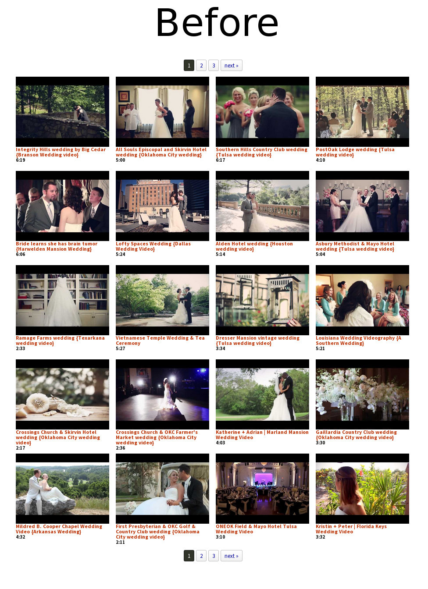 

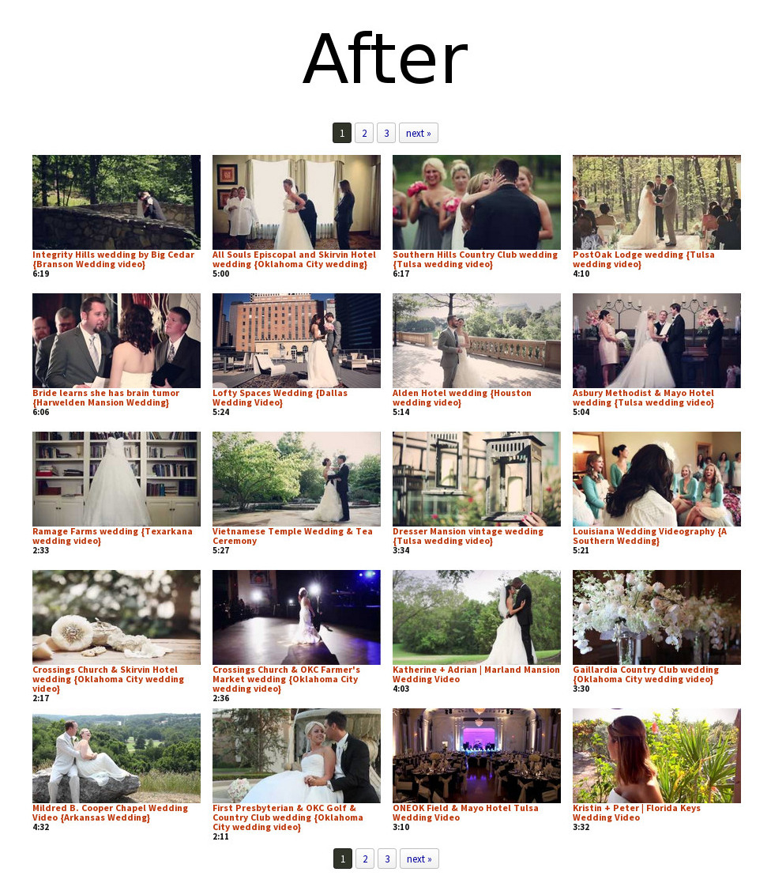

</ExpansionPanel>

<Message warning>
    <Message.Header>
        Warning
    </Message.Header>
    <Message.Content>

Use of this add-on will change the aspect ratio of YouTube thumbnails from 4:3 to 16:9. You will likely want to adjust your settings for `thumbHeight` and `thumbWidth`.

</Message.Content>
</Message>

### Installation

1. Purchase and download the YouTube Black Bars Remover add-on from the [TubePress Dashboard](https://dashboard.tubepress.com/downloads).

1. Using FTP, unzip the file you downloaded (`youtube-black-bars-remover_x_y_z.zip`) into the add-ons subdirectory of your [TubePress Content Directory](/docs/page/the-tubepress-content-directory) (`wp-content/tubepress-content/add-ons`).

1. You should now have a directory at `wp-content/tubepress-content/add-ons/youtube-black-bars-remover_x_y_z` (where `x`, `y`, and `z` are the major, minor, and micro version numbers of the add-on).

1. [Clear the TubePress system cache](../cache#system-cache) once so TubePress discovers the add-on.

### Usage

You can activate this add-on from `WP Admin > Settings > TubePress`. Navigate to the "Thumbnails" tab and scroll to the bottom of the page. There you will see a checkbox which enables/disables the black bar removal.

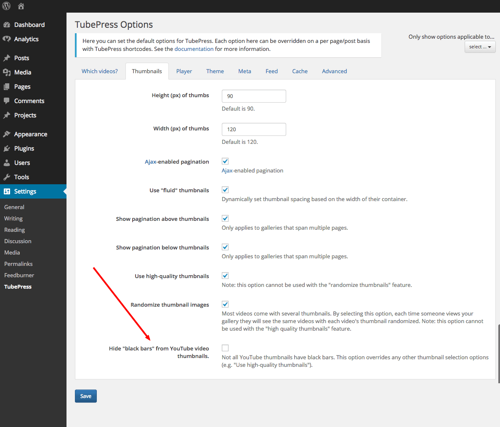

## Vimeo All Access

This TubePress add-on provides TubePress with enhanced access to your Vimeo Plus or PRO account, thus allowing TubePress to work with private Vimeo videos. This is particularly useful if you’d like to hide your videos from display on vimeo.com and only show them on your website.

To make a video private, choose the last radio icon in the privacy settings for the video as shown below:

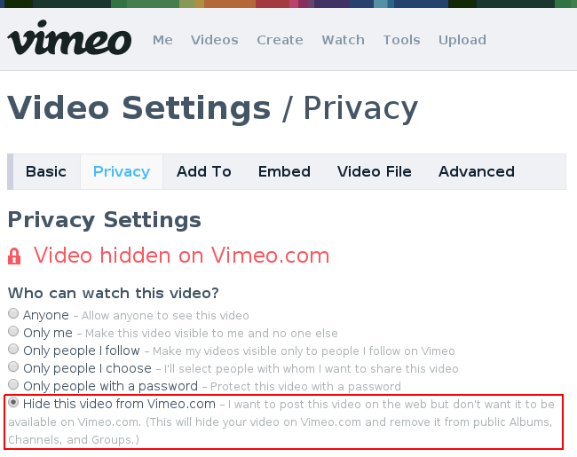

### Installation

1. Purchase and download the Vimeo All Access add-on from the [downloads page of the TubePress Dashboard](https://dashboard.tubepress.com/downloads).

1. Using FTP, unzip the file you downloaded (`vimeo-all-access_x_y_z.zip`) into the add-ons subdirectory of your [TubePress Content Directory](/docs/page/the-tubepress-content-directory) (`wp-content/tubepress-content/add-ons`).

1. You should now have a directory at `wp-content/tubepress-content/add-ons/vimeo-all-access_x_y_z` (where `x`, `y`, and `z` are the major, minor, and micro version numbers of the add-on).

1. [Clear the TubePress system cache](/docs/page/the-system-cache) once so TubePress discovers the add-on.

### Usage

1. If you haven't already done so, [complete the initial Vimeo API setup](/docs/page/vimeo-api-setup-for-wordpress) process. 
 
1. Under the "Feed" tab of your TubePress settings page, scroll down to the Vimeo area and click the "New token" button. 

    

    A popup window will open and ask for your permission to allow TubePress to access your private videos. Click the "Allow" button to grant permission. 
  
    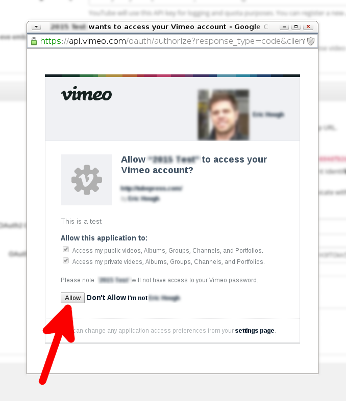
  
    The popup window should close itself automatically and you should see a success message. 
  
    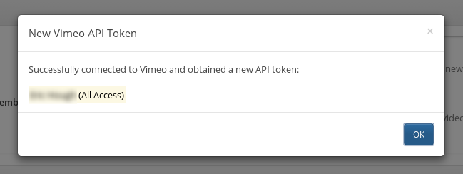
  
    And you should see a new token in your list of API tokens. 
  
    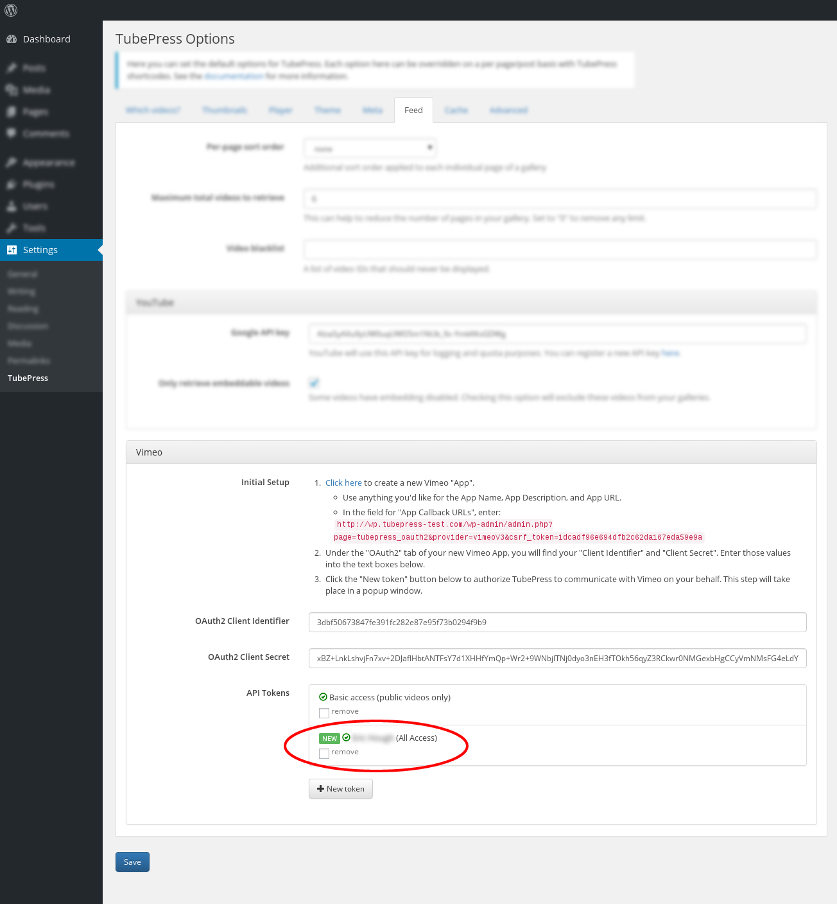
  
1. Under the "Which Videos?" tab, select the "Feed Options" tab for any Vimeo video source. Use the "API Token" dropdown menu to choose your new All Access token.

    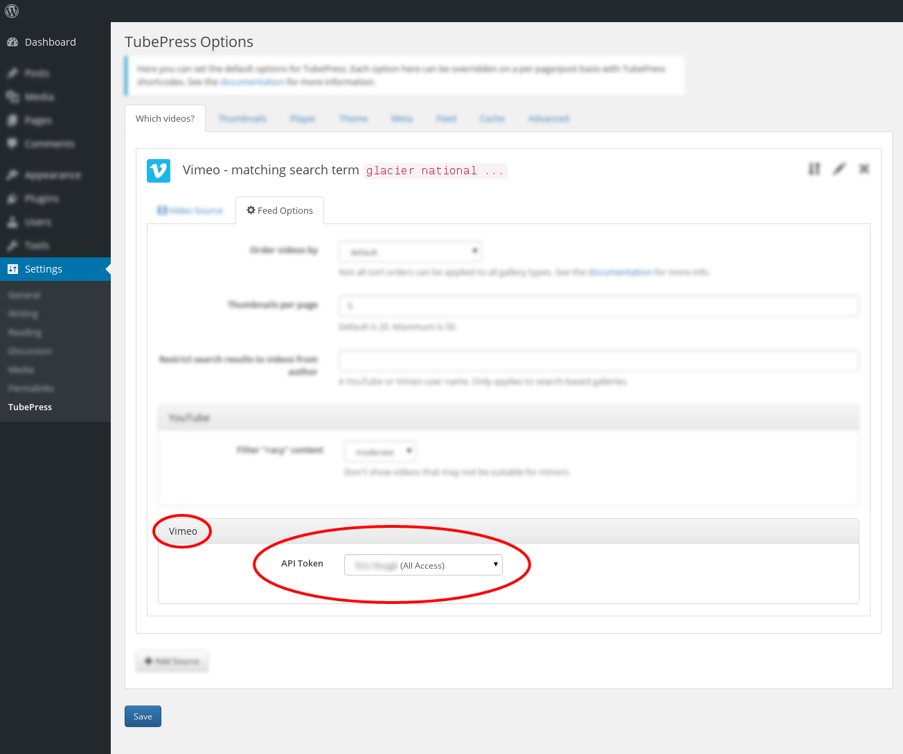
  
1. You may repeat the above process to obtain additional tokens, which may be useful if you have several Vimeo accounts under your control.

## Flexible Thumbnail Rows

This add-on automatically adjusts the height of thumbnail rows in TubePress galleries, ensuring that the metadata (runtime, title, description, etc.) for each video is completely visible. This overcomes TubePress themes that might use a fixed height for the thumbnail rows where any metadata that is taller than the row will be cut off.

### Screenshots

<ExpansionPanel title="Before and after screenshots">

  

</ExpansionPanel>

<Message info>
    <Message.Header>
        Note
    </Message.Header>
    <Message.Content>

All non-legacy themes distributed with TubePress will not require this add-on as they use other CSS techniques to ensure that all thumbnail data is visible. This add-on is useful for all the TubePress "legacy" themes, or third-party themes that cut off thumbnail metadata.
</Message.Content>
</Message>

### Installation

1. Purchase and download the Flexible Thumbnail Rows add-on from [the downloads page on the TubePress Dashboard](https://dashboard.tubepress.com/downloads).

1. Using FTP, unzip the file you downloaded (`flexible-thumbnail-rows_x_y_z.zip`) into the add-ons subdirectory of your [TubePress Content Directory](/docs/page/the-tubepress-content-directory) (`wp-content/tubepress-content/add-ons`).

1. You should now have a directory at `wp-content/tubepress-content/add-ons/flexible-thumbnail-rows_x_y_z` (where `x`, `y`, and `z` are the major, minor, and micro version numbers of the add-on).

1. [Clear the TubePress system cache](/docs/page/the-system-cache) once so TubePress discovers the add-on.

### Usage

You can activate this add-on from `WP Admin > Settings > TubePress`. Navigate to the "Thumbnails" tab and scroll to the bottom of the page. There you will see a checkbox which enables/disables the add-on.

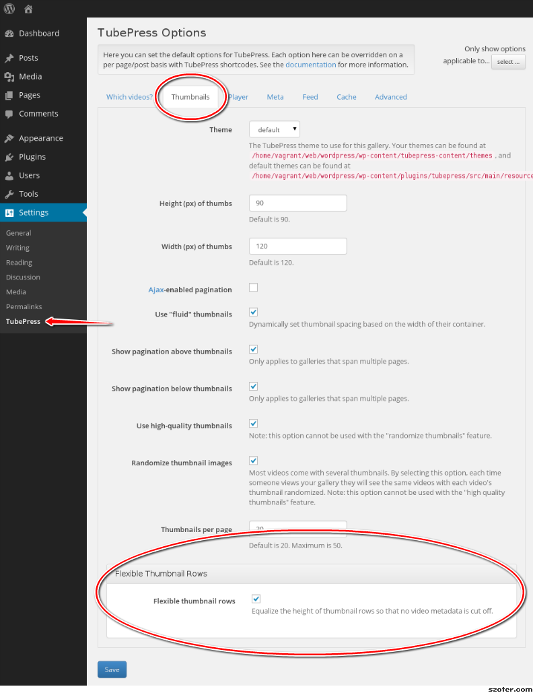
    
## QuickPlay

This TubePress add-on replaces video thumbnail images with fully-functional embedded video players. Among other things, this allows your users to watch your videos right within the context of your gallery. It also makes it easy to [showcase the latest video from a collection](#latest-video).

### Screenshots

<ExpansionPanel title="Before and after screenshots">

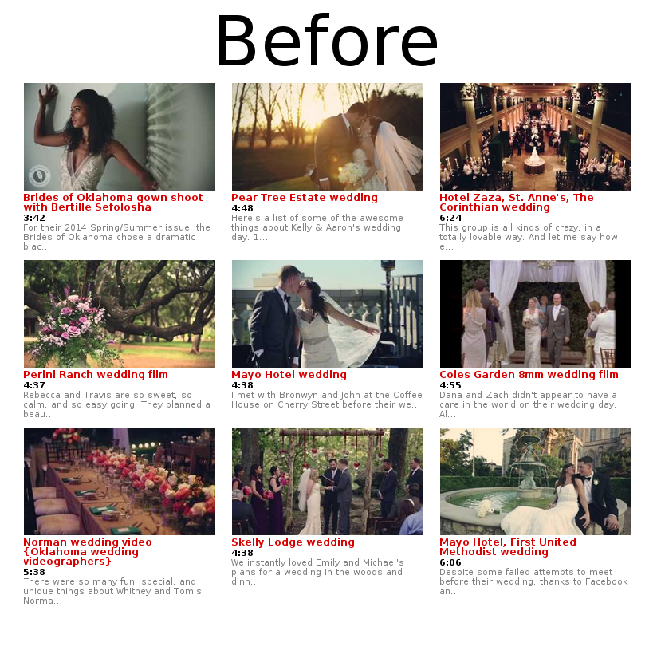
  
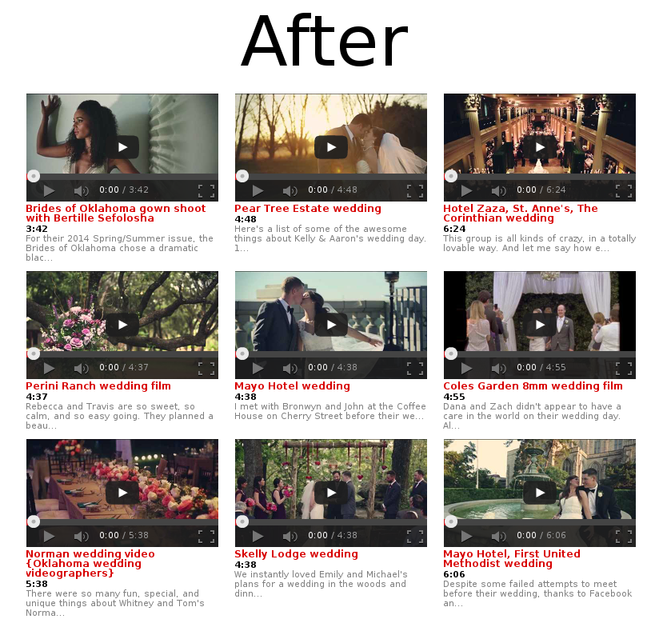

</ExpansionPanel>

### Installation

1. Purchase and download the QuickPlay add-on from [the downloads page on the TubePress Dashboard](https://dashboard.tubepress.com/downloads).

1. Using FTP, unzip the file you downloaded (`quickplay_x_y_z.zip`) into the add-ons subdirectory of your [TubePress Content Directory](/docs/page/the-tubepress-content-directory) (`wp-content/tubepress-content/add-ons`).

1. You should now have a directory at `wp-content/tubepress-content/add-ons/quickplay_x_y_z` (where `x`, `y`, and `z` are the major, minor, and micro version numbers of the add-on).

1. Copy (or symlink) the directory at `wp-content/tubepress-content/add-ons/quickplay_x_y_z/tubepress-theme` to `wp-content/tubepress-content/themes/quickplay`

1.  [Clear the TubePress system cache](/docs/page/the-system-cache) once so TubePress discovers the add-on and theme.

### Basic Usage

Anytime you [add TubePress to a post or page](/docs/page/add-tubepress-to-a-post-or-page), set the options `enableQuickplay="true"` and `theme="tubepress/quickplay"`, e.g.

`[tubepress enableQuickplay="true" theme="tubepress/quickplay"]`

### Controlling Height and Width of the Embeds

To control the height and width of the embedded video players, you can simply use the `embeddedHeight` and `embeddedWidth` options. `thumbHeight` and `thumbWidth` are ignored when this add-on is in use.

### Show the Latest Video from a Collection

A common question we get from users is:

>How can I have an embedded video player that automatically shows the latest video from my YouTube or Vimeo channel?

With QuickPlay, this is easy to do for any collection of videos. The trick is to set `resultCountCap="1"` and `orderBy="newest"`. For instance, say that you’d like to show the latest video from YouTube user `engineerguyvideo`. The following invocation would achieve this:

    [mode="user" userValue="engineerguyvideo" resultCountCap="1" orderBy="newest" enableQuickplay="true" theme="tubepress/quickplay" embeddedWidth="480" embeddedHeight="270"]

The result is an always-updating, fully-customizable single video embed that you can embed anywhere on your site.

  
