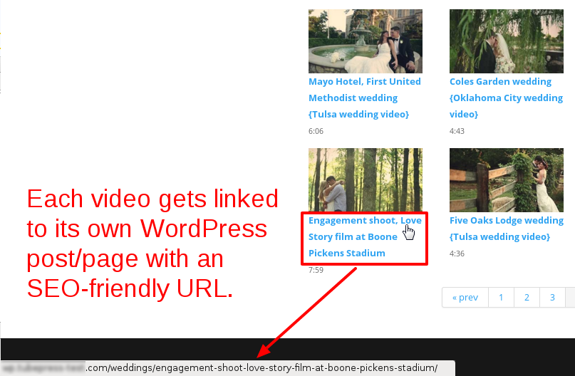
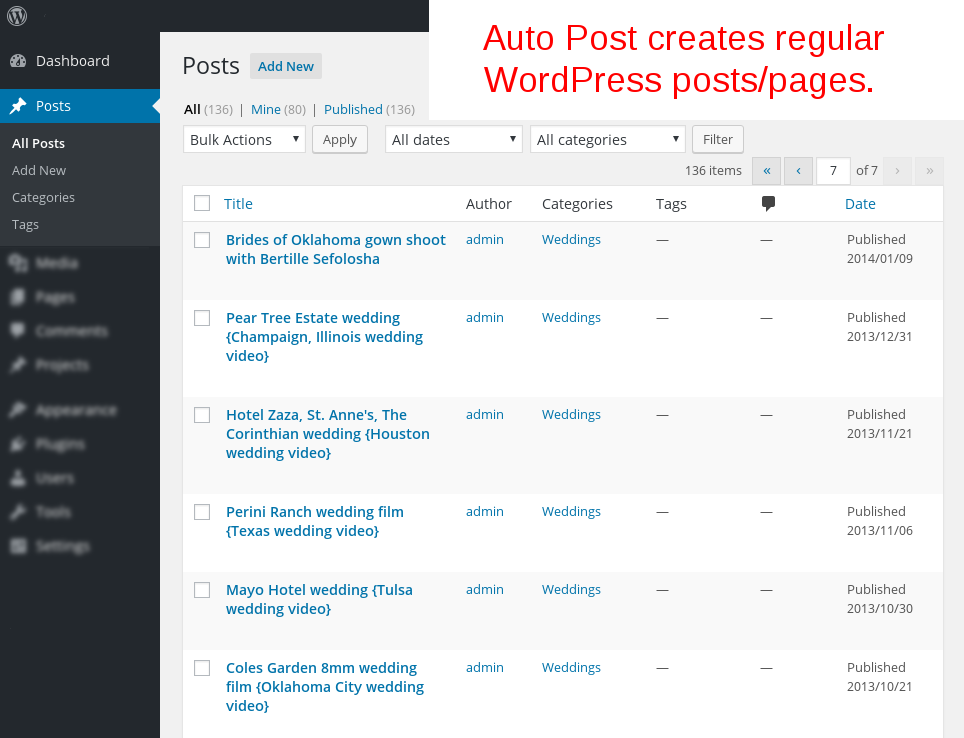
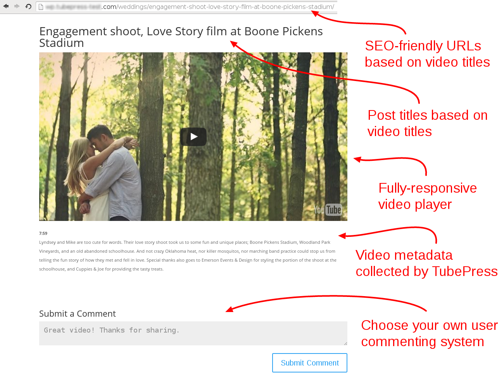
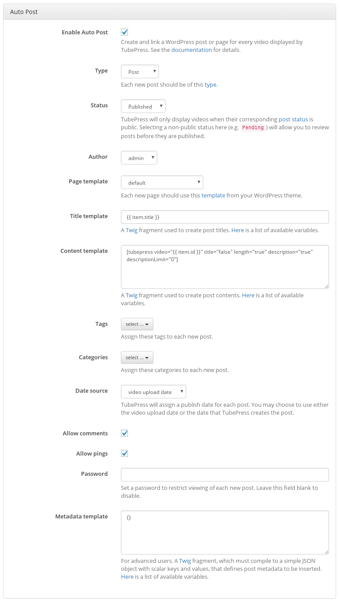

## Why use Auto Post?
Auto Post allows TubePress to automatically generate WordPress posts or pages for each video in a TubePress gallery. This powerful feature, introduced in TubePress 5.1.0, enables two main benefits for WordPress users:

1. **Dramatically improved search engine optimization (SEO)**

     Each video in a TubePress gallery will be linked to a post or page on your site. With [properly-configured permalinks](https://www.elegantthemes.com/blog/tips-tricks/wordpress-permalinks), this can lead to a significant boost in search ranking for your site's subject area.

2. **In-house discussion threads**
 
     Since each video now occupies a post or page on your site, you can completely control the comments and discussion for your videos. You can utilize [WordPress's built-in comment system](https://codex.wordpress.org/Comments_in_WordPress) or a popular third-party system such as [Disqus](https://disqus.com/). 
 
Auto Post is essentially like having a personalized youtube.com (or vimeo.com or dailymotion.com, or a combination of these) hosted entirely within your website.

## Screenshots
For every video in a TubePress gallery with Auto Post enabled, TubePress will create and link a WordPress post (or page) to house the video player, metadata, and comments. 
  
  
 
These are standard WordPress posts/pages that you can manage as usual. The post/page titles are based on the video title by default, but this is fully configurable. 

   
  
The content of each post/page is fully configurable and can be customized to your liking. 

  
 
## How to Enable Auto Post

!!! warning

    **Auto Post has the capability to quietly generate an enormous number of posts or pages on your site. Please ensure that you read these instructions carefully and understand the ramifications of enabling this feature.**

1. Navigate to the TubePress options page at `WP Admin > Settings > TubePress`. 
 
1. Click the "WordPress" tab and scroll down to the "Auto Post" area. Adjust your settings, and when you're ready, tick the box for "Enable Auto Post" to activate the feature. Each setting is described in detail [below](/feature/wordpress/autopost/#configuration). 
 
1. Visit a page on your site with a TubePress gallery. If you have configured `Auto Post > Status` to be anything other than `Publish`, you'll need to manually publish the posts/pages (e.g. from `WP Admin > Posts`) before any videos show up in your gallery. 
 
## Configuration
In this section we describe each Auto Post setting in detail.

 
 
  **Enable Auto Post**

  * Enables or disables the Auto Post feature [site-wide](/feature/wordpress/autopost/#can-i-enable-auto-post-on-only-some-of-my-tubepress-galleries).

  **Type**
  
  * The [type](https://wordpress.org/support/article/post-types/) of the posts that will be created. Typically this is posts or pages, but it also includes any custom types that you may have in your installation. Only public types are allowable.

  **Status**
  
  * The initial [status](https://wordpress.org/support/article/post-status/) of the posts that will be created. TubePress will only display videos when their corresponding post status is public. Selecting a non-public status here (e.g. `Pending`) will allow you to review posts before they are published.

  **Author**
  
  * The WordPress user that will be listed as the author of the new posts.

  **Page template**

  * The [template](https://codex.wordpress.org/Templates) that will be used to display the new pages. This setting only applies when "Type" is set to `Page`, as WordPress doesn't allow for posts to utilize custom templates (at least not by default).

  **Title template**
  
  * A [Twig](http://twig.sensiolabs.org/) fragment used to create post titles. See the [Variables section below](#template-variables) for the variables available to you.

  **Content template**
  
  * A [Twig](http://twig.sensiolabs.org/) fragment used to create post contents. See the [Variables section below](#template-variables) for the variables available to you.

  **Tags**
  
  * Any WordPress tags that should be assigned to each new post.

  **Categories**

  * Any WordPress categories that should be assigned to each new post.

  **Date source**
  
  * TubePress will need to assign a publish date for each new post. You may choose to use either the video's publication date, or the date that TubePress creates the post.

  **Allow comments**
  
  * Enables or disables [WordPress comments](https://wordpress.org/support/article/comments-in-wordpress/) for the new posts.

  **Allow pings**
  
  * Whether or not the post can accept pings.

  **Password**
  
  * You may password-protect each new post. Leave this field empty to disable password protection.

  **Metadata template**
  
  * This feature is for advanced users only. A [Twig](http://twig.sensiolabs.org/) fragment, which must compile to a simple JSON object with scalar keys and values, that defines post metadata to be inserted. See the [Variables section below](#template-variables) for the variables available to you.

## Template Variables
Below is a list of template variables that may be used in Auto Post.

| Variable              | Description                                                                                                                                                                                                                                                                                                  |
|-----------------------|--------------------------------------------------------------------------------------------------------------------------------------------------------------------------------------------------------------------------------------------------------------------------------------------------------------|
| `item`                | An object, representing the video, with the [attributes found here](/docs/page/theme-variables-video-metadata). You may use a dot (`.`) to access these attributes, e.g. `item.title` would represent the video's title.                                                                                     |
| `post.allow_comments` | Either `open` or `closed`, depending on whether or not the post can accept comments.                                                                                                                                                                                                                         |
| `post.allow_pings`    | Either `open` or `closed`, depending on whether or not the post can accept pings.                                                                                                                                                                                                                            |
| `post.author`         | A [WP_User](https://codex.wordpress.org/Class_Reference/WP_User) instance representing the author of the post.                                                                                                                                                                                               |
| `post.categories`     | An array, which may be empty, of [WP_Term](https://developer.wordpress.org/reference/classes/wp_term/) instances representing the categories assigned to the post.                                                                                                                                           |
| `post.metadata`       | Post metadata that will be inserted along with the post. This includes information internal to TubePress, along with any metadata that you have defined in the setting for "Metadata template". Of course, this variable is not available to the "Metadata template" as that would result in circular logic. |
| `post.password`       | The password used to protect the post. This may be empty if no password was set.                                                                                                                                                                                                                             |
| `post.status`         | An object representing the status assigned to the post. The `name` attribute on the object may be `publish`, `pending`, or any other registered [post status](https://wordpress.org/support/article/post-status/).                                                                                                      |
| `post.tags`           | An array, which may be empty, of [WP_Term](https://developer.wordpress.org/reference/classes/wp_term/) instances representing the tags assigned to the post.                                                                                                                                                 |
| `post.template`       | The WordPress template that will be used to display this post. This will either be `default` or the filename of the template (e.g. `full-width.php`).                                                                                                                                                        |
| `post.time`           | A [DateTime](http://php.net/manual/en/class.datetime.php) instance representing the post publication date and time.                                                                                                                                                                                          |
| `post.title`          | The post title, as calculated by the setting for "Title template". This variable is only available to the "Content template" setting.                                                                                                                                                                        |
| `post.type`           | An object representing the type assigned to the post. The `name` attribute on the object may be `post`, `page`, or any other registered [post type](https://wordpress.org/support/article/post-types/).                                                                                                                 |"

## FAQ

### Can I enable Auto Post on only some of my TubePress galleries?

Yes, you can enable/disable Auto Post on a per-gallery basis using shortcodes. Use `[tubepress wpAutoPostEnable="true"]` to enable and `[tubepress wpAutoPostEnable="false"]` to disable. (For more information on shortcodes, see [this page]().)

### Why am I seeing "No matching videos" when I enable Auto Post?

If your post/page status is anything other than "Publish", your gallery will not display. Check for any "Pending" or similarly non-public posts/pages from `WP Admin > Posts` or `WP Admin > Pages` and publish or delete them as appropriate. If you delete posts/pages, you will also need to fully delete them by emptying the trash (e.g. `WP Admin > Posts > Trash`).

### When I enable Auto Post, the video player disappears - why?

With Auto Post, the embedded video player for each video in a gallery is housed on a linked post/page rather than where your Auto Post-enabled gallery appears. Essentially, an Auto Post gallery is a gallery of video thumbnails. Clicking one of the thumbnails will direct you to the post/ page where that video can be played, commented on, etc. 

