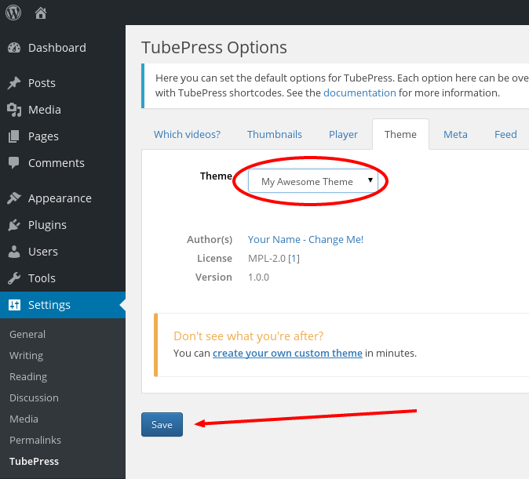

In the simplest terms, TubePress injects content into your website so that your visitors can view your video galleries. The look and feel of this TubePress-generated content is controlled by a TubePress *theme*, which you can think of as the "skinning" mechanism for TubePress.

By default, TubePress is distributed with several themes that look great on nearly any website. But by creating and using your own custom theme, you can take full control of TubePress's output and tightly integrate it into your website.

## Step-by-Step Tutorial
In the following section, you can learn to create and use your own custom TubePress theme in 10 minutes or less.**You don't need to be a computer expert to do this, though it's helpful to have a basic understanding of FTP.**

### Required Tools
Make sure that you have the following before you start:

*   FTP access (or otherwise) to your web server  
     
*   A text editor. If you don't have one, [Sublime Text](http://www.sublimetext.com/) is free to use for a while and works well on all platforms.

### Procedure

1.  Using FTP, log in to your website and locate your [TubePress Content Directory](the-tubepress-content-directory) at `wp-content/tubepress-content`.  
     
2.  Inside your [TubePress Content Directory](the-tubepress-content-directory), open the `themes` subdirectory. Inside that, you will find a directory named `starter`.  
     
        wp-content/
        │
        └── tubepress-content/
            │
            ├── add-ons/
            │
            ├── config/
            │
            └── themes/
                │
                └── starter/              <----------------------
    
       
     
    This directory contains a theme that TubePress has installed specifically for this tutorial and is a [child](/customer/portal/articles/2046075-hierarchical-themes) of the default TubePress theme.
    
    
    **Note**
    
    If the starter directory isn't there, which is a possibility in some installations, you can reproduce it easily:
    
    1.  Using FTP, download the file at `wp-content/plugins/tubepress_pro_x_y_z/web/themes/starter.zip` to your desktop.  
         
    2.  Unzip this file. It will expand into a directory named `starter`.  
         
    3.  Using FTP, upload the `starter` directory to `wp-content/tubepress-content/themes`  
         
    4.  Verify that you now have a directory on your web server at `wp-content/tubepress-content/themes/starter`
    
      
     
3.  Inside the `starter` theme directory, you will find a file named `theme.json`. Download `theme.json` to your desktop using FTP. 
     
        wp-content/
        │
        └── tubepress-content/
            │
            ├── add-ons/
            │
            ├── config/
            │
            └── themes/
                │
                └── starter/
                    │
                    └── theme.json        <----------------------
        
    
    **All themes must have a file named `theme.json` which provides some basic metadata to TubePress.**
      
     
4.  Open `theme.json` with your text editor. Once open, you'll be able to see some facts about the theme, such as its name, authors, license, screenshots, etc.
    
     
     
    
5.  Change the theme name by editing the `name` field from `changeme/themename` to _anything_ else, though we suggest lowercase alphanumerics and slashes. For instance:
    
        "name" : "eric/mytheme"
    
        
     
    
    The name you choose should be **globally unique** as it will uniquely identify this theme to TubePress.
    
      
     
6.  Change the theme title by editing the `title` field from `Theme Title - Change Me!` to whatever you'd like. The title you choose will be visible to you only. For example:
    
        "title" : "My Awesome Theme"
    
        
     
7.  Save your changes to `theme.json` using your text editor and re-upload it to its original location on your website using FTP. You will want to overwrite the original file.
    
      
     
8.  [Rebuild the system cache](/customer/portal/articles/2048959-the-system-cache) so that TubePress detects your changes and accepts the new theme.
    
      
     
9.  Back in your web browser, navigate to `WP Admin > Settings > TubePress > Theme` and ensure that your new theme shows up in the drop-down menu.
    
     
     
10.  Make sure your theme is selected in the theme drop-down and click the `Save` button to activate your theme.
    
        
     
11.  Let's test what we've done so far. Using WordPress, open [any page with TubePress on it](/docs/page/add-tubepress-to-a-post-or-page). Since this theme is a [child](/customer/portal/articles/2046075-hierarchical-themes) of the default TubePress theme with no local changes, everything should look identical to the default theme at this point.
    
        
     
    
    Now we can start making changes. As an example, let's say that we want to make the following modifications:
    
    *   round off the corners of all video thumbnails
    *   lighten the font color of the video titles
    *   italicize the video runtime  
         
    
    Since these changes can all be done via CSS, we'll edit one of our theme's CSS files.
    
      
     
12.  Using FTP, download `css/theme.css` from the `starter` theme directory (see [Step 1](#procedure))
    
        wp-content/
        │
        └── tubepress-content/
            │
            ├── add-ons/
            │
            ├── config/
            │
            └── themes/
                │
                └── starter/
                    │
                    └── css
                        │
                        └── theme.css    <----------------------
            
    
      
     
13. Open `theme.css` with your text editor and add the following new CSS rules:
    
    ```css
    /*
     * Round off the thumbnail corners.
     */
    div.tubepress-thumb img {
    
        -webkit-border-radius: 15px;
        -moz-border-radius: 15px;
        border-radius: 15px;
    }
    
    /*
    * Lighten up the video titles.
    */
    dd.tubepress-meta-title {
        
        font-weight: 200;
    }
    
    /*
    * Italicize the video duration.
    */
    dd.tubepress-meta-duration {
    
        font-style: italic;
    }


   
    
14.  Save your changes to `theme.css`, then re-upload it its original location on your website using FTP. You will want to overwrite the original file.
    
      
     
15.  With your web browser, head back to your test page from Step 11 and hit refresh. You should see the changes from your new CSS.
    
        
     

**Congratulations!** You have successfully created and activated your own custom TubePress theme. Of course, that is just a fraction of all that's possible.

### Where to Go Next

Now that you've got the basics down, you're ready to really take advantage of TubePress:

*   Delve further into the [anatomy of a theme](#anatomy-of-a-theme)  
     
*   Explore what else your [theme's manifest](#theme-manifest-file) can do for you  
     
*   Add or edit your theme's [HTML templates](#html-templates)  
     
*   Add or edit your theme's [CSS or JavaScript](#css-and-javascript)  
     
*   Learn about the power of [hierarchical themes](#hierarchical-themes)

## Anatomy of a Theme

This section describes **what** a TubePress theme is and **where** TubePress expects to find themes.

### Definition
A TubePress theme is a directory on your web server's filesystem that contains all of the following:

 * Exactly one [manifest](#theme-manifest-file), which is a file named `theme.json` at the theme directory's root. 
 
 * Zero or more HTML [templates](#html-templates) inside the `templates` directory at the theme directory's root. 
 
 * Zero or more [CSS stylesheets and/or JavaScript scripts](#css-and-javascript), each referenced by the `resources` property of the [manifest](#theme-manifest-file). 
 
 * Any other supporting web resources (images, fonts, etc.) required by your CSS, JavaScript, or templates. You may store such resources wherever you like inside your theme directory. 
 
### Location
During execution, TubePress will expect to find the active theme in one of two possible locations on your web server's filesystem:

 1. The `themes` subdirectory of your [TubePress Content Directory](/docs/page/the-tubepress-content-directory)

    * This is the directory where you should store all themes that are not shipped with TubePress (e.g. custom themes). This directory is **upgrade-safe**, meaning that its contents will be preserved when you upgrade TubePress. **This is where you should save your custom themes.**

 1. Inside the TubePress codebase at `<tubepress-install-directory>/web/themes`

    * This directory holds the themes that are shipped with TubePress. While you *can* modify the themes in this directory, **any changes made here will be wiped out when you upgrade TubePress**. You can refer to this directory for examples of properly structured and functioning themes.

## Theme Manifest File
Each TubePress theme must have a "manifest" file named `theme.json` at the root of the theme directory. This is a simple [JSON](http://www.json.org/) file that contains metadata about the theme.

When editing any `theme.json`, we strongly suggest that you run its contents through an [online JSON validator](http://jsonlint.com/) to ensure there are no syntax errors.

Let's go through this file in detail.

### Required Fields
Below is a minimal `theme.json` with all the required fields filled in.

```json
{
    "name" : "tubepress/default",
    "version": "4.1.8",
    "title" : "Default",
    "authors" : [
        {
            "name" : "TubePress LLC",
            "url" : "http://tubepress.com"
        }
    ],
    "license": {
        "type" : "MPL-2.0",
        "urls" : [ "http://www.mozilla.org/MPL/2.0/" ]
    }
}
```

* `name` 
 
  **Required**. The globally unique name of this theme. You can use nearly any value here, but we recommend using a "vendor name" (e.g. your GitHub username, company name, or last name), followed by a slash (`/`), followed by the theme name.

  This field must be 100 characters or less, and is case insensitive. 

* `version` 
 
  **Required**. The [semantic version](http://semver.org/) of this theme. Used in TubePress's options GUI. 

* `title`
 
  **Required**. The human-readable title of this theme. Used in TubePress's options GUI.

  This field must be 255 characters or less. 

* `authors`
 
  **Required**. An [array](https://en.wikipedia.org/wiki/JSON#Data_types.2C_syntax_and_example) of one or more [objects](https://en.wikipedia.org/wiki/JSON#Data_types.2C_syntax_and_example) with at least the `name` property. `name` is the theme author's proper name (or company name). In addition to `name`, you may also include `email`, `url`, and `role` to identify each author's email address, URL, and role.

  The author name must be 200 characters or less. 
 
* `license`
 
  **Required**. An [object](https://en.wikipedia.org/wiki/JSON#Data_types.2C_syntax_and_example) defining the license(s) of this theme. Each license object **must** include a `type` property which uniquely identifies the software license. This can either be an abbreviation of an [open source license](http://opensource.org/licenses), `proprietary` for closed-source themes, or a combination of these concatenated with the `+` symbol. Also required here is the `urls` property, which is an [array](https://en.wikipedia.org/wiki/JSON#Data_types.2C_syntax_and_example) of one or more URLs pointing to the appropriate license text(s).

  The `type` field must be 100 characters or less. 
 

### Optional Fields
Below is a sample `theme.json` with all the required and optional fields filled in.

```json
{
    "name" : "tubepress/default",
    "version": "4.1.8",
    "title" : "Default",
    "authors" : [
        {
            "name" : "TubePress LLC",
            "url" : "http://tubepress.com"
        }
    ],
    "license": {
        "type" : "MPL-2.0",
        "urls" : [ "http://www.mozilla.org/MPL/2.0/" ]
    },
    "description" : "This is a sample theme used for educational purposes.",
    "keywords" : [ "sample", "bootstrap", "word" ],
    "urls" : {
        "homepage" : "http://foo.bar/home.html",
        "docs"     : "http://docs.mytheme.com/",
        "demo"     : "http://demo.site/test.php",
        "download" : "http://my.site/download.php",
        "bugs"     : "http://bugs.thistheme.com/report.php",
    },
    "screenshots" : [
        ["http://some.site.com/thumbnail.png", "http://some.site.com/fullsize.png"],
        ["http://absolute.path/to/thumb.jpg" ]
    ],
    "parent" : "tubepress/default",
    "resources" : {
        "scripts" : [ "js/script1.js", "js/anotherScript.js" ],
        "styles" : [ "css/style.css", "css/otherStyle.css" ]
    }
}
```
Let's go through each optional field one by one.

* `description`
 
  *Optional*. A description of this theme. Used in TubePress's options GUI.

  This field must be 5000 characters or less. 
 
* `keywords`
 
  *Optional*. An [array](https://en.wikipedia.org/wiki/JSON#Data_types.2C_syntax_and_example) of keywords/tags associated with this theme. Used in TubePress's options GUI.

  Each keyword must be 30 characters or less. 
 
* `urls`
 
  *Optional*. An [object](https://en.wikipedia.org/wiki/JSON#Data_types.2C_syntax_and_example) defining relevant URLs on the web for this theme. This can help point your users in the right direction for support.

  `homepage`, `docs`, `demo`, `download`, and `bugs` are the only allowed properties here. 
 
* `screenshots`
 
  *Optional*. An [array of arrays](https://en.wikipedia.org/wiki/JSON#Data_types.2C_syntax_and_example) defining URLs to screenshots of the theme. Used in TubePress's options GUI.

  Each sub-array of the parent `screenshot` array must contain 1 or 2 absolute URLs to images. If given two image URLs, TubePress will use the first as the thumbnail image for the second. This leads to a better user experience and is the recommended format; however, you may also use a single image URL which will be used for both the thumbnail and full-size preview. There are no size restrictions on these images, though we recommend that you keep your thumbnails to no larger than 200px by 200px.

  All image URLs must end with either `.png` or `.jpg`. 

* `parent` 
 
  *Optional*. Defines the parent theme by its `name` property. See the [hierarchical themes](#hierarchical-themes) documentation for details on how this works. 
 
* `parent/resources?`
 
  *Optional*. An [object](https://en.wikipedia.org/wiki/JSON#Data_types.2C_syntax_and_example) that contains the `scripts` and/or `styles` properties, which in turn define the JavaScript script files and CSS stylesheets for this theme.

  Both the `scripts` and `styles` property values must be arrays containing relative paths (from the theme's root directory) to a CSS stylesheet or JavaScript script. CSS file paths must end in `.css` and JavaScript file paths must end in `.js`. Resources will be loaded in the order in which they are defined here, with any parent theme resources loaded first.

## HTML Templates

During its execution, TubePress relies on a set of [Twig](http://twig.sensiolabs.org/) templates to produce its final HTML. A TubePress theme may contain templates that TubePress will use instead of its defaults, thereby giving you full control of the HTML structure of TubePress's output.

**Note**
If you only want to change the *style* of TubePress's output, you probably don't need to bother with editing templates. Instead, try to [utilize CSS in a theme](#css-and-javascript). Templates control the *structure* of the final HTML, which doesn't need to change as often.

### Logical Template Names

TubePress uses a handful of templates, each identified uniquely by a logical name. The following table lists the logical name of each template, along with a description of where it's used.

| Logical Template Name           | Used for ...                                                                                                                                                                                          |
|---------------------------------|-------------------------------------------------------------------------------------------------------------------------------------------------------------------------------------------------------|
| `css/scripts`                   | JavaScript tags and inline JavaScript that TubePress produces. This will end up either in the HTML `<head>` or right before the closing `</body>` tag.                                                                   |
| `css/styles`                    | CSS tags and inline CSS that TubePress produces. This will end up in the HTML `<head>`.                                                                                                               |
| `exception/ajax`                | Returning an error message after a TubePress Ajax operation fails.                                                                                                                                    |
| `exception/static`              | Displaying an error message to the user when TubePress hits an unrecoverable error.                                                                                                                   |
| `gallery/players/<player>/ajax` | Returning HTML to be displayed to the user after a thumbnail is clicked. Replace `<player>` with the name of any [TubePress player location name](/docs/page/video-player-options#player-location) (e.g. `shadowbox`).                                     |
| `gallery/players/<player>/static` | Returning HTML, to be displayed along with the initial load of thumbnails, that contains the embedded video. Replace `<player>` with the name of any [TubePress player location name](/docs/page/video-player-options#player-location) (e.g. `shadowbox`). |
| `gallery/main`                  | Arguably the most important template. Controls overall layout of video galleries and thumbnails.                                                                                                      |
| `gallery/pagination`            | Clickable page numbers for galleries that span multiple pages.                                                                                                                                        |
| `search/input`                    | Interactive search input text field and button.                                                                                                                                                       |
| `search/ajax-input`               | Ajax-enabled interactive search input text field and button.                                                                                                                                          |
| `single/main`                     | Single video embeds.                                                                                                                                                                                  |

### Template Selection Process
Each logical template name must be converted to an actual template file on your web server. TubePress uses the following search procedure to accomplish this task.

1. **Check active theme **

   First TubePress looks for a directory named `templates` at the root directory of the active theme. If this directory exists, TubePress looks inside for a template with the *relative* (from the `templates` directory) filesystem path of `<logical-template-name>.html.twig`. If a file at that path is found, TubePress will use this given template and the search ends here.

   For instance, given the logical template name `gallery/pagination`, TubePress would look inside the active theme directory for a file at `templates/gallery/pagination.html.twig`.

1. **Check parent theme **
 
   If the active theme has a [parent theme](#hierarchical-themes), the previous step is repeated with the parent theme. This is a recursive process, so TubePress will search up the entire [theme hierarchy](#hierarchical-themes) until there are no more theme parents to check. If the template is still not found, TubePress goes on to the step below.

1. **Revert to default, internal template **
 
   If the previous steps fail to locate a template file on the filesystem, TubePress will revert to a default, internal template to produce the HTML. 
 
### Editing Templates
If you'd like to make changes to a template, we strongly recommend that you first read [Twig's excellent template documentation](http://twig.sensiolabs.org/doc/templates.html). This will guide you through the entire process of editing a template.

Twig templates are compiled and cached on the filesystem for maximum performance. If you add, remove, or edit a template file, you will need to [clear the TubePress system cache](/docs/page/the-system-cache) before you see the changes live on your site.

## CSS and JavaScript

In its [manifest](#theme-manifest-file), a TubePress theme can include any number of CSS stylesheets and JavaScript scripts. TubePress will ensure that the active theme's resources are loaded correctly into the final web page. This provides you with an upgrade-proof means of tweaking the overall look and feel of your TubePress galleries.

Unlike [templates](#html-templates), there are no conventions on where you store your CSS and JavaScript files; they only need to be somewhere inside a theme's directory.

### Adding a New CSS or JavaScript File
Here's the procedure to add a CSS stylesheet or JavaScript script to your theme:

1. Save the new CSS or JavaScript file to any location within your theme directory. 
 
1. Edit your [theme's manifest](#theme-manifest-file) to include the **relative**, from the theme's root directory, path to the new file. You should add this to the manifest `resources` property.

   For instance, if you have saved a single CSS file for your theme at `tubepress-content/themes/mytheme/css/style.css`, then your manifest's resources property might look something like this:

   ```json
   ...

    "resources" : {
        "styles" : [ "css/style.css" ]
    }

   ...
   ```

1. [Rebuild the system cache](/docs/page/the-system-cache) so that TubePress detects your theme's new files.

**Note**
Any time you *add* or *remove* a CSS or JavaScript file from a theme, you will need to [rebuild the system cache](/docs/page/the-system-cache). However, simply *editing* these files does not require a cache rebuild.

### Important Caveat
Due to the way that PHP works, **only the theme selected in persistent storage can have its CSS & JavaScript loaded on your website**.

The "theme selected in persistent storage" refers to the theme that you have selected at `WP Admin > Settings > TubePress > Theme`.

You *can* use multiple invocations of TubePress on a single page, each using a different `theme` value (either set by shortcode or via an option passed to `TubePressPro::getHTML()`). However, only the [templates](#html-templates) from those themes can be used - not the CSS & JavaScript.

## Hierarchical Themes

TubePress themes can *optionally* have a parent theme by defining a parent property in the theme's manifest. This makes it very easy to tweak an existing theme, or have a family of similar themes.

**Warning**
Be aware that child themes can be very sensitive to changes to their parents. If you are concerned about stability, hierarchical themes may not be the right choice.

Here's how the theme hierarchy works:

 * The `parent` property in a [theme's manifest](#theme-manifest-file) *may* contain the `name` property of another locally-installed theme. In this case, we call the former theme a "child" and the latter its "parent." 
 
 * There is no limit on the depth of the theme ancestry. 
 
 * During template selection, if the active theme does *not* contain a particular template, the theme's ancestors will be searched. In other words, **templates found in child themes take priority**. 
 
 * CSS and JS files will be loaded in a **parents-first** manner. To clarify, let's look at how CSS files are loaded in the following theme hierarchy:

| **Theme name** | **Theme parent** | **CSS files**                     |
|----------------|------------------|-----------------------------------|
| `grandparent`  | *none*           | `css/four.css`                    |
| `parent`       | `grandparent`    | * `css/three.css` * `css/two.css` |
| `grandchild`   | `parent`         | `css/one.css`                     |

Assuming that the grandchild theme is active, TubePress would load all four CSS files in the following order:

   * `css/four.css`
   * `css/three.css`
   * `css/two.css`
   * `css/one.css`
 
The same logic applies to JavaScript scripts.

## Theme Variables

This section lists the attributes that are available for each video handled by TubePress.

  * [`authorDisplayName`](#author-display-name)
  * [`authorUid`](#author-uid)
  * [`authorUrl`](#author-url)
  * [`category`](#category)
  * [`commentCount`](#comment-count)
  * [`commentCountFormatted`](#comment-count-formatted)
  * [`countDislikes`](#count-dislikes)
  * [`countDislikesFormatted`](#count-dislikes-formatted)
  * [`countFavorited`](#count-favorited)
  * [`countFavoritedFormatted`](#count-favorited-formatted)
  * [`description`](#description)
  * [`duration`](#duration)
  * [`durationInSeconds`](#duration-in-seconds)
  * [`homeUrl`](#home-url)
  * [`id`](#id)
  * [`invokingAnchorHref`](#invoking-anchor-href)
  * [`invokingAnchorRel`](#invoking-anchor-rel)
  * [`invokingAnchorTarget`](#invoking-anchor-target)
  * `keywords`
  * `keywordsFormatted`
  * `likesCount`
  * `likesCountFormatted`
  * [`provider`](#provider)
  * `ratingAverage`
  * `ratingCount`
  * [`thumbnailUrl`](#thumbnail-url)
  * [`timePublishedFormatted`](#time-published-formatted)
  * [`timePublishedUnixTime`](#time-published-unix-time)
  * [`title`](#title)
  * [`viewCount`](#view-count)
  * [`viewCountFormatted`](#view-count-formatted)

#### `authorDisplayName`

||
|----------------|--------------------------------------------------------------------------|
| Description    | The display name of the user/channel that uploaded/owns the video       |
| Examples       |KatyPerryVEVO, Seeking Nirvana, Red Bull |

#### `authorUid`

||
|----------------|------------------------------------------------------------------------------------------------------------|
| Description    | The internal (to the video host) name of the user/channel that uploaded/owns the video                    |
| Examples       |`UC1yBKRuGpC1tSM73A0ZjYjQ` (YouTube), `user48494445` (Vimeo), `RedBull` (Dailymotion) |

#### `authorUrl`

||
|----------------|-----------------------------------------------------------------------------------------------------------------------------------------------------------------------------------------------------|
| Description    | The public URL to the user/channel that uploaded/owns the video                                                                                                                                    |
| Examples       |`https://www.youtube.com/channel/UC1yBKRuGpC1tSM73A0ZjYjQ` (YouTube), `https://vimeo.com/user48494445` (Vimeo), `https://www.dailymotion.com/RedBull` (Dailymotion) |

#### `category`

||
|----------------|-----------------------------------------------------------------------------------------|
| Description    | The display name of the video's assigned category                                      |
| Examples       |Pets & Animals (YouTube), Comedy & Entertainment (Dailymotion) |
| Note           | This attribute is not available for Vimeo videos.                                       |

#### `commentCount`

||
|----------------|-------------------------------------------------------------------------------------------------------|
| Description    | The raw, unformatted count of the number of comments that this video has received on its hosted page |
| Examples       |5326, 98948                                                                  |
| Note           | This attribute is only available for YouTube videos.                                                  |

#### `commentCountFormatted`

||
|----------------|------------------------------------------------------------------------------------------------|
| Description    | The formatted count of the number of comments that this video has received on its hosted page |
| Examples       |5,326, 98,948                                                         |
| Note           | This attribute is only available for YouTube videos.                                           |

#### `countDislikes`

||
|----------------|------------------------------------------------------------------------------------|
| Description    | The raw, unformatted count of the number of dislikes that this video has received |
| Examples       |5326, 98948                                               |
| Note           | This attribute is only available for YouTube videos.                               |

#### `countDislikesFormatted`

||
|----------------|-----------------------------------------------------------------------------|
| Description    | The formatted count of the number of dislikes that this video has received |
| Examples       |5,326, 98,948                                      |
| Note           | This attribute is only available for YouTube videos.                        |

#### `countFavorited`

||
|----------------|---------------------------------------------------------------------------------------------|
| Description    | The raw, unformatted count of the number of times this video has been marked as a favorite |
| Examples       |5326, 98948                                                        |
| Note           | This attribute is only available for YouTube videos.                                        |

#### `countFavoritedFormatted`

||
|----------------|--------------------------------------------------------------------------------------|
| Description    | The formatted count of the number of times this video has been marked as a favorite |
| Examples       |5,326, 98,948                                               |
| Note           | This attribute is only available for YouTube videos.                                 |

#### `description`

||
|----------------|----------------------------------------------------------------------|
| Description    | The full video description                                           |
| Notes          | Video descriptions may contain simple HTML (mainly just line breaks) |


#### `duration`

||
|----------------|------------------------------------------------------------|
| Description    | The formatted duration of the video |
| Examples       |`0:13`, `3:45`, `2:15:57`  |
| Note           | Leading zeros are used for videos less than 1 minute long |

#### `durationInSeconds`

||
|----------------|-----------------------------------------------|
| Description    | The duration, in seconds, of the video       |
| Examples       |`13`, `225`, `3498` |

#### `homeUrl`

||
|----------------|---------------------------------------------------------------------------------------------------------------------------------------------------------------------------------------------------------------------------|
| Description    | The URL of this video on its original host                                                                                                                                                                               |
| Examples       |`https://www.youtube.com/watch?v=9bZkp7q19f0`, `https://vimeo.com/154698227`, `https://www.dailymotion.com/video/x3zg56v_cliff-diving-victoria-falls-the-world-s-largest-waterfall_sport` |

#### `id`

||
|----------------|--------------------------------------------------------------------------------------------------------------------------------------------------------------------------------------------------------|
| Description    | The globally-unique video identifier                                                                                                                                                                   |
| Examples       |`1cGsm_eaNhw` (YouTube), `159681647` (Vimeo), `dailymotion_x3rx1nb` (Dailymotion)                                                                                      |
| Notes          |YouTube video IDs are always 11 characters long, Vimeo video IDs are always composed of just numbers, TubePress prefixes all Dailymotion video IDs with `dailymotion_` |

#### `invokingAnchorHref`

||
|----------------|-------------------------------------------------------------------------------------------------------------------------------------------------------------------------------------------------------------------------------------------------------------------------------|
| Description    | When TubePress is configured to play a video on a new page (not within the same page), this attribute holds the URL of the new page (i.e. it will end up in the `href` attribute of the invoking [HTML anchor](https://developer.mozilla.org/en-US/docs/Web/HTML/Element/a)). |
| Examples       |`/videos/my-awesome-video`, `http://some-domain.com/some_video.php`                                                                                                                                                                                  |
| Notes          |This attribute is not present when TubePress is configured to display videos on the same page, The URL may be relative or absolute                                                                                                                 |

#### `invokingAnchorRel`

||
|----------------|-----------------------------------------------------------------------------------------------------------------------------------------------------------------------------------------------------------------------------|
| Description    | When TubePress is configured to play a video on a new page (not within the same page), this attribute holds the `rel` attribute of the invoking [HTML anchor](https://developer.mozilla.org/en-US/docs/Web/HTML/Element/a). |
| Examples       |`external`, `nofollow`                                                                                                                                                                             |
| Notes          | This attribute is not present when TubePress is configured to display videos on the same page.                                                                                                                              |

#### `invokingAnchorTarget`

||
|----------------|--------------------------------------------------------------------------------------------------------------------------------------------------------------------------------------------------------------------------------|
| Description    | When TubePress is configured to play a video on a new page (not within the same page), this attribute holds the `target` attribute of the invoking [HTML anchor](https://developer.mozilla.org/en-US/docs/Web/HTML/Element/a). |
| Examples       |`_blank`, `_self`                                                                                                                                                                                     |
| Notes          | This attribute is not present when TubePress is configured to display videos on the same page.                                                                                                                                 |

#### `countLikes`

||
|----------------|---------------------------------------------------------------------------------|
| Description    | The raw, unformatted count of the number of likes that this video has received. |
| Examples       |5326, 98948                                            |
| Note           | This attribute is not available for Dailymotion videos.                         |

#### `likesFormatted`

||
|----------------|--------------------------------------------------------------------------|
| Description    | The formatted count of the number of likes that this video has received. |
| Examples       |5,326, 98,948                                   |
| Note           | This attribute is not available for Dailymotion videos.                  |

#### `provider`

||
|----------------|-------------------------------------------------------------------|
| Description    | The internal name (to TubePress) of the video host.               |
| Examples       |`dailymotion`, `vimeo`, `youtube` |

#### `thumbnailUrl`

||
|----------------|---------------------------------------------------------------------------------------------------------------------------------------------------------------------------------------------------------------------------------|
| Description    | The URL of the thumbnail image that will be used for this video.                                                                                                                                                                |
| Examples       |`https://i.ytimg.com/vi_webp/DNGmD6FcQdY/default.webp` (YouTube), `https://i.vimeocdn.com/video/555342641_295x166.webp` (Vimeo), `https://s1-ssl.dmcdn.net/JJNhr/118x118-2He.png` (Dailymotion) |

#### `timePublishedFormatted`

||
|----------------|--------------------------------------------------------------------------------------------|
| Description    | The formatted publication/upload date and time of the video.                               |
| Examples       |`Nov. 3, 2014`, `November 3, 2014 at 3:45 pm`, `yesterday` |

#### `timePublishedUnixTime`

||
|----------------|--------------------------------------------------------------------------------------------------------------|
| Description    | The publication/upload date and time, in [Unix time](https://en.wikipedia.org/wiki/Unix_time), of the video. |
| Examples       |`1458616813`, `915148800`                                                           |

#### `title`

||
|----------------|-------------------------------------------------------------------------------|
| Description    | The video title                                                               |
| Examples       |Evolution of Dance, Eye of India, After Hours |

#### `viewCount`

||
|----------------|-------------------------------------------------------------------------------|
| Description    | The raw, unformatted count of the number of times this video has been viewed. |
| Examples       |5326, 98948                                          |

#### `viewCountFormatted`

||
|----------------|------------------------------------------------------------------------|
| Description    | The formatted count of the number of times this video has been viewed. |
| Examples       |5,326, 98,948                                 |

