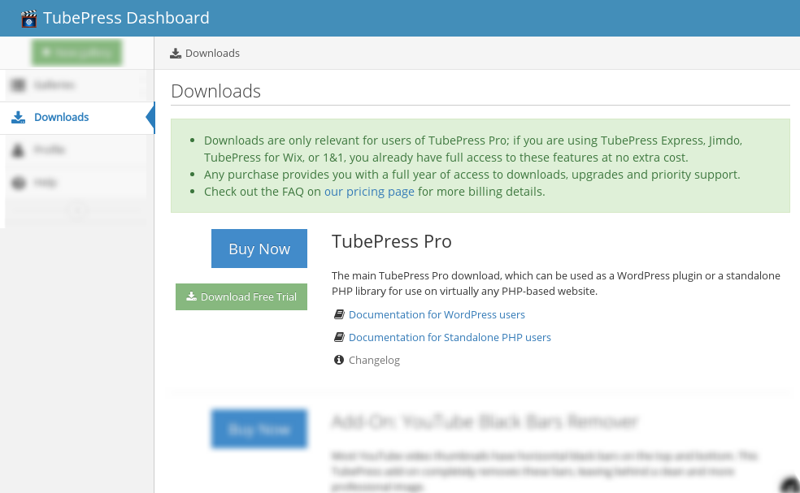
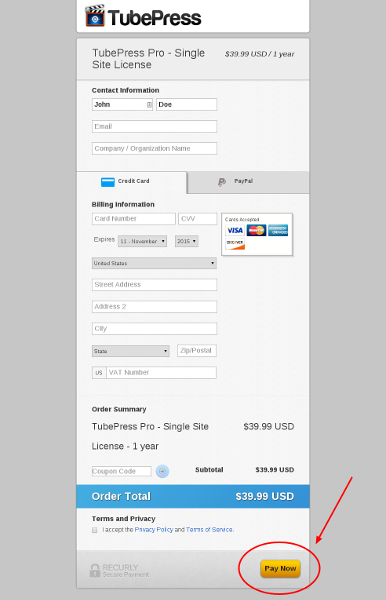
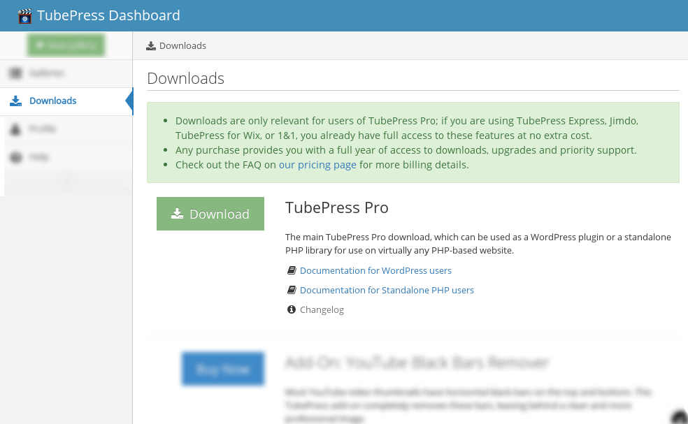
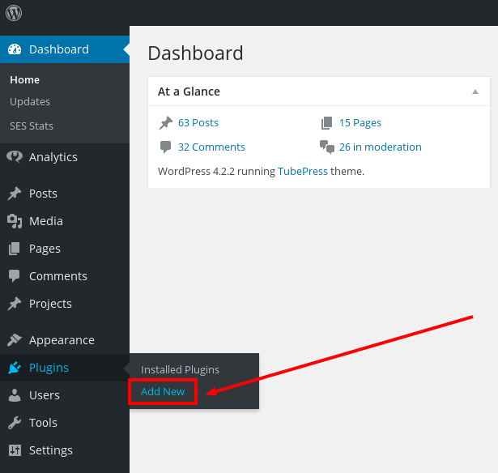
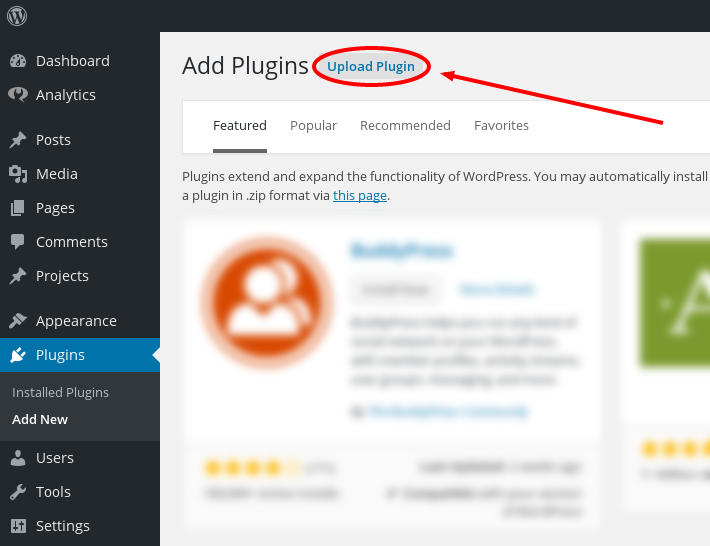
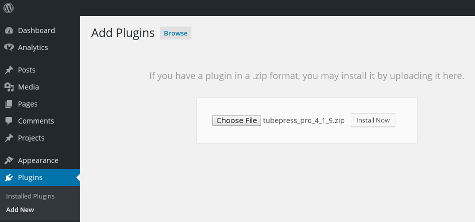
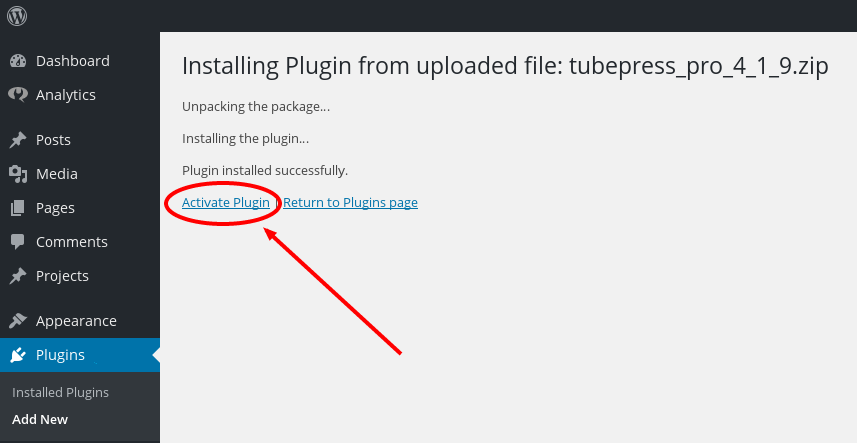

import { Message } from 'semantic-ui-react';

## Requirements

It’s a good idea to first make sure that your web server meets the minimum requirements to run TubePress:

* PHP 5.3.29 **without** the [APC extension ](https://en.wikipedia.org/wiki/List_of_PHP_accelerators#Alternative_PHP_Cache_.28APC.29)
 
* WordPress 3.0

Please note that these are the minimum requirements and TubePress will also work with all later versions of PHP and WordPress. Not sure if your server meets these requirements? You should either:

1. Ask your hosting provider or 
 
2. Install a WordPress plugin that prints out your system information. Here are some examples: 
 
    * [WordPress phpinfo()](https://wordpress.org/plugins/wordpress-php-info/)
    * [WP-ServerInfo](https://wordpress.org/plugins/wp-serverinfo/)
 
## Download

1. Visit [the Downloads page](https://dashboard.tubepress.com/downloads) in the TubePress Dashboard. **If you've already paid for TubePress Pro, please skip to step 5.** 
 
2. On the Downloads page, you'll see a list of available downloads with TubePress Pro at the top. You may download the free trial version of TubePress here, or you may click the "Buy Now" button when you are ready to buy. 

    

3. Once you've chosen the [TubePress Pro license](http://tubepress.com/license/) applicable to you, you'll be presented with a secure payment page where you may choose to pay with credit card or PayPal. Enter your billing information, review and accept our Privacy Policy and Terms of Service, and click "Pay Now".

    

4. After payment is complete, you'll be redirected to a Thank You page. [Revisit the Downloads page](https://dashboard.tubepress.com/downloads) where you will now have access to TubePress Pro. 
 
5. <a id="step-5"></a> Click the "Download" button to download TubePress Pro as a zip file. 

    

## Upload

TubePress can be installed just like any other WordPress plugin, though since we don’t distribute through the [wordpress.org plugin repository](https://wordpress.org/plugins/), you’ll have to install the plugin manually. Thankfully, [WordPress provides excellent documentation](https://codex.wordpress.org/Managing_Plugins#Manual_Plugin_Installation) on how to manually install plugins.

### Manual FTP Upload

1. [Download TubePress](#download) as a zip file to your local machine. 
 
2. Unzip the file. 
 
3. With your FTP program, upload the unzipped folder to the `wp-content/plugins` folder in your WordPress directory on your web server. 
 
4. Go to `WP Admin > Plugins` and find TubePress in your plugin list. 
 
5. Click **Activate Plugin** to activate it.

If you are using TubePress Pro, you may want to proceed with these [optional installations](#optional).

### Alternative Upload Method

If you would rather not use FTP to upload TubePress, you may attempt to install the plugin directly from within the WordPress administration panel. This method *may* also be faster than using FTP.

<Message warning
    header='Warning'
    content='This installation method may "timeout" on slower web servers, and for that reason we officially only recommend the FTP installation method.' />

1. [Download TubePress](/docs/page/download) as a zip file to your local machine. 
 
2. From your WordPress admin dashboard, click the link at Plugins > Add New

    
 
3. At the top of the page, click the "Upload Plugin" link.

    
 
4. Select the zip file that you downloaded in step 1, then click the "Install Now" button.

    
 
5. If the installation succeeds, you'll see the following screen. Click the **Activate Plugin** link.

    

If you are using TubePress Pro, you may want to proceed with the optional installations outlined below.
 
## Optional Installations

<Message info>
    <Message.Header>
        Note
    </Message.Header>
    
This section only applies to TubePress Pro users. If you are using the free trial version of the plugin, you can safely skip this section.

</Message>

Due to licensing restrictions, TubePress Pro does not ship with every library that the free trial plugin includes. However, these optional libraries may be installed manually as follows:

### JW Player (version 5.x)

TubePress can use [JW Player](http://www.jwplayer.com/) 5.10 to play YouTube videos. We are working to integrate JW Player 7.x, but this feature is not yet ready for production.

1. Download the file player.swf from [here](https://github.com/tubepress/tubepress/raw/v4.0.0/src/add-ons/jwplayer5/web/player.swf). 
 
2. Upload the file to your TubePress Pro installation at

    `wp-content/tubepress-content/vendor/jwplayer/v5/player.swf`
   
    You may need to create the `vendor` directory and its subdirectories.

### Shadowbox.js

1. Download Shadowbox.js from [here](http://tubepress-cdn.com/shadowboxjs/shadowbox-3.0.3.zip). 
 
2. The download will save to a file named shadowbox-3.0.3.zip. Unzip this file, and it will expand into a directory named `shadowbox-3.0.3`. 
 
3. Copy the **contents** of this directory (**not** the directory itself) to your TubePress Pro installation at `wp-content/tubepress-content/vendor/shadowboxjs/v3/`. You may need to create the `vendor` directory and its subdirectories. 
 
4. *Optional*. You may see scrollbars in the Shadowbox.js display. To fix this, simply edit `shadowbox.css`. On line 8, remove the `overflow:auto` attribute, i.e. change it from 
 
    ```css
    #sb-player.html{height:100%;overflow:auto;}
    ```

    to 
 
    ```css
    #sb-player.html{height:100%;}
    ```
