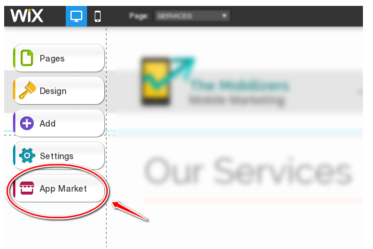
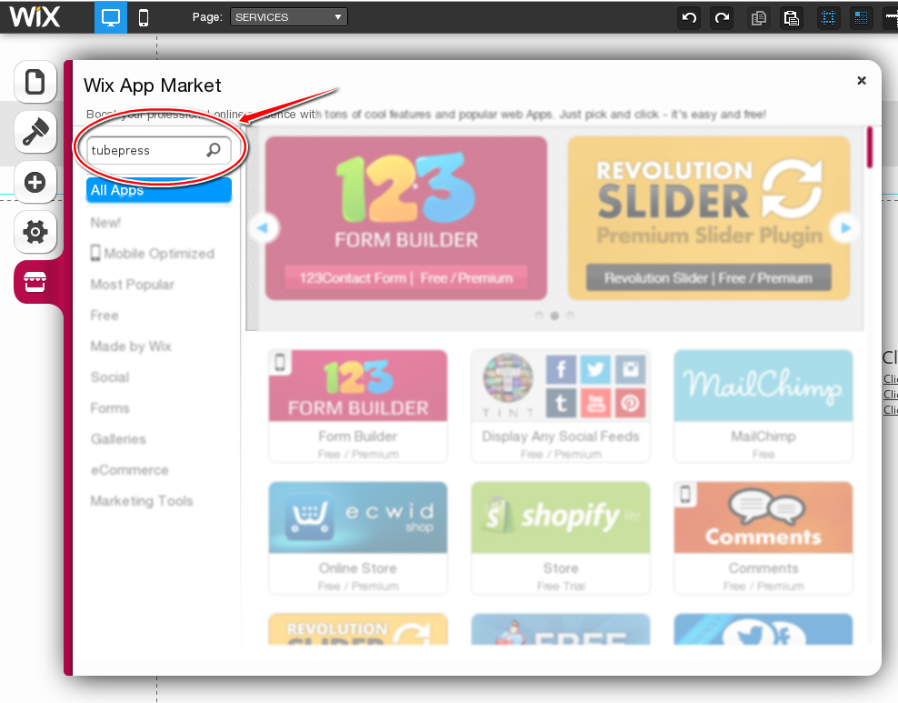
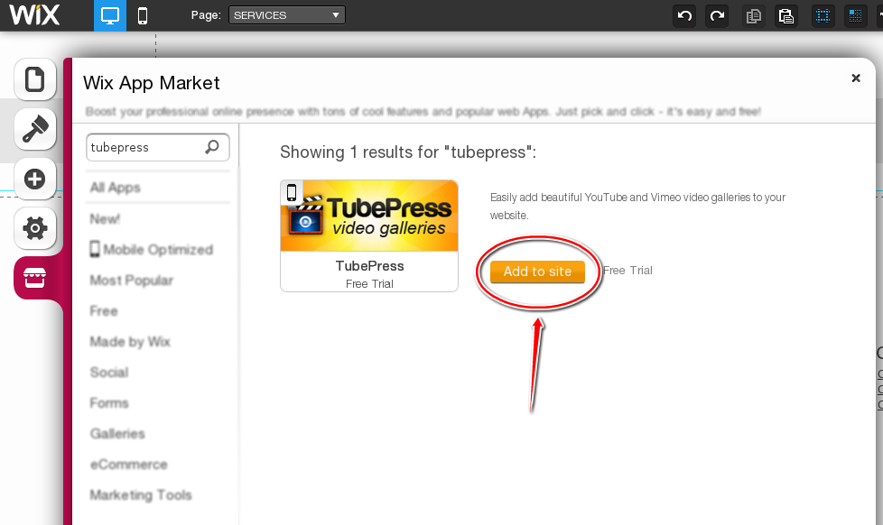
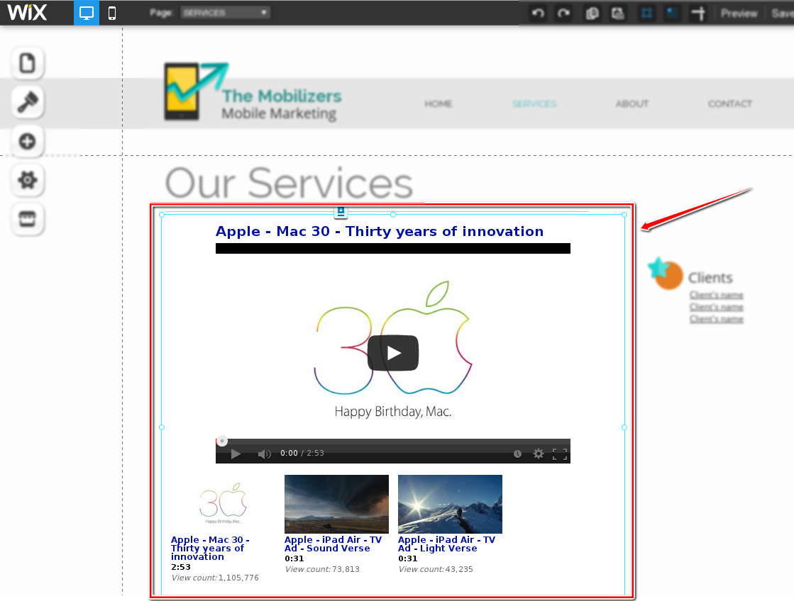
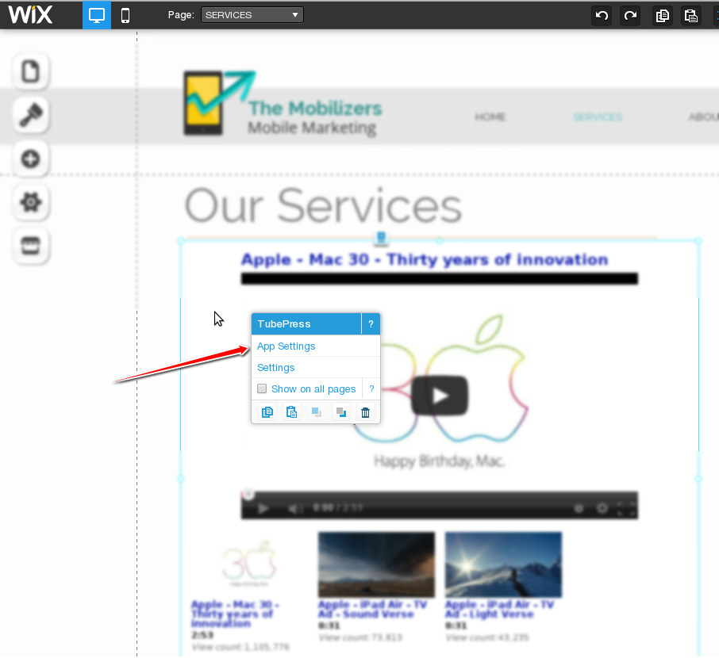
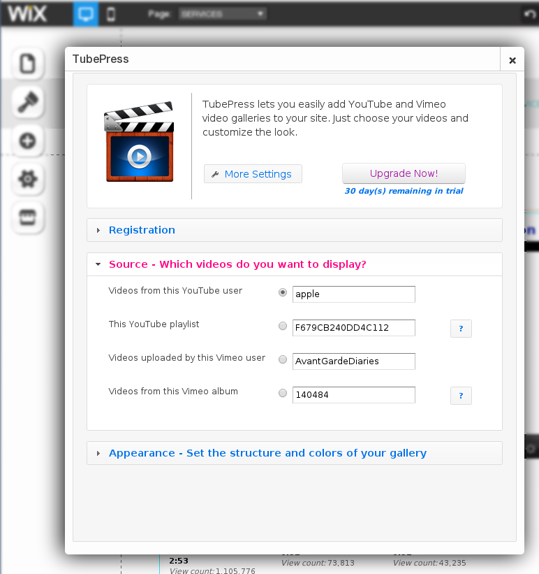
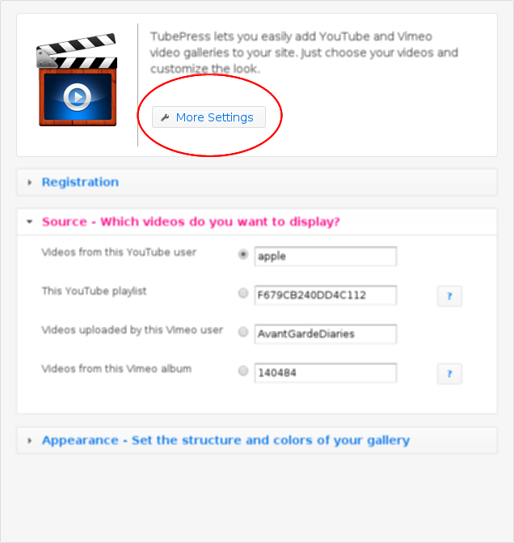
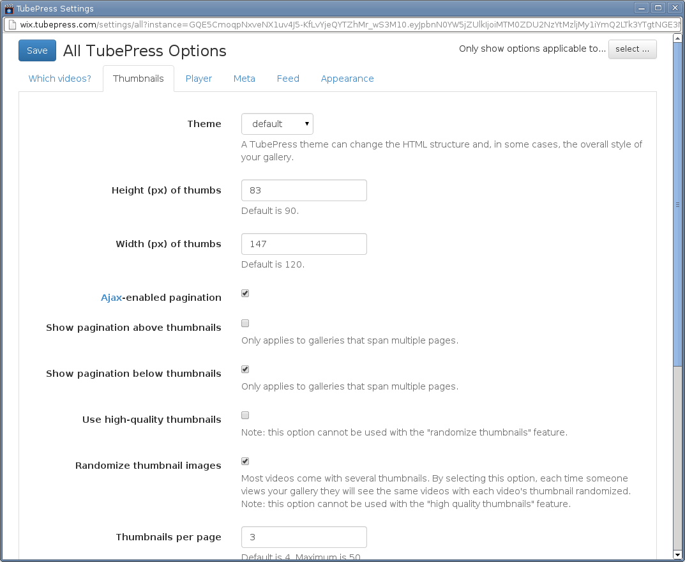

TubePress is available to all [Wix](https://www.wix.com/) websites via the [Wix App Market](https://www.wix.com/app-market/tubepress/overview). Since TubePress LLC manages the hosting of TubePress, there is no installation, upgrade, or maintenance required.

## Adding to your site

This section details how to add the TubePress app to your Wix site. It assumes that you already have a Wix website up and running; if not, Wix offers [excellent documentation](https://support.wix.com/en/article/getting-started-with-wix) to get you started. Wix also provides [detailed documentation on how to use the App Market](https://www.wix.com/support/html5/wix-app-market/adding-apps-to-your-site/).

1. Inside the Wix Editor, click the App Market button. 

    

1. The Wix App Market window will open. In the search box at the top left, type in `tubepress` and hit enter. 

    
   
1. The TubePress app will show in your search results. Click the "Add to Site" button to add TubePress to your site. 

    
    
1. TubePress will be added to your site in a "box" that you may now move around and resize to your liking - just like any other Wix element. 

    
    
## Configuration

Configuring TubePress in Wix is easy.

### Basic Configuration

1. Click on the TubePress instance that you'd like to configure. You'll see a popup menu. Click the link for "App Settings".

    

1. A small window will popup which contains some simple settings for TubePress. Feel free to click around and change some of the options. Your changes will be reflected "live" so that you can see the result immediately.

    
	
### Full Configuration

The settings found in the small popup window are actually **a small fraction of the settings available to you**. We simply "hide" them so as to not overwhelm new users. Here's how to access the "full" settings:

1. Click the "More Settings" button

    
    
1. A new window will open which contains all of the TubePress settings. Feel free change any setting you like, and click the "Save" button once you're done.

    

## FAQ

### How much does it cost?

TubePress is available to all Wix.com users for a free 30-day trial. To continue using the service beyond the trial period, we charge a small monthly fee which is added to your Wix bill. Wix provides [detailed instructions](https://www.wix.com/support/html5/article/upgrading-an-app-from-the-wix-app-market) on how to pay for TubePress.

### How many sites can I use TubePress on?

Wix bills on a per-site basis. For instance if you have two Wix.com websites that are both using TubePress, you will be billed twice: once for each website. However, there is no limit to the number of times that you may add TubePress to any website. Even if you use TubePress in twenty different places on your site, you will still just be billed once.

### How do I transfer TubePress to a different Wix website?

  You will need to cancel TubePress and re-purchase it on your new website. This is a [limitation imposed by Wix](https://www.wix.com/support/html5/article/transferring-an-upgraded-app-to-another-wix-site-or-account).

### What happens if I miss a payment?

If your trial period ends before payment, or if you miss a payment, TubePress will simply "go dark" on your website and your site visitors will see an empty box where TubePress used to be. You may continue to access the TubePress settings from within the site editor. After Wix receives [payment](https://www.wix.com/support/html5/article/upgrading-an-app-from-the-wix-app-market), TubePress will pick up right where you left off. You won’t lose anything.
