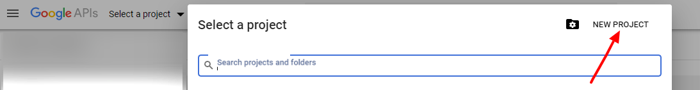
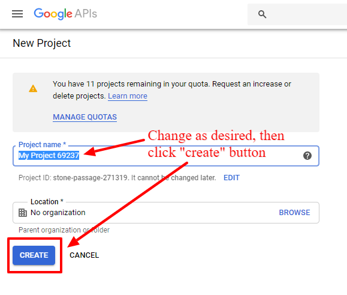
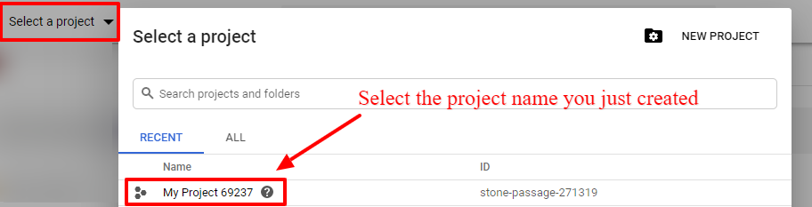
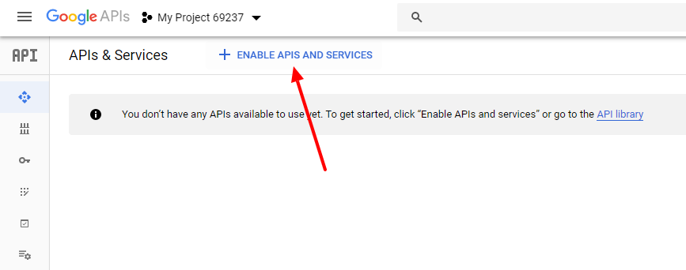
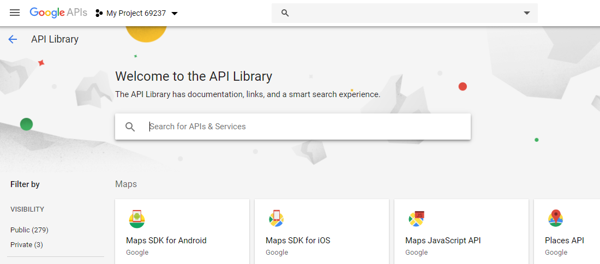
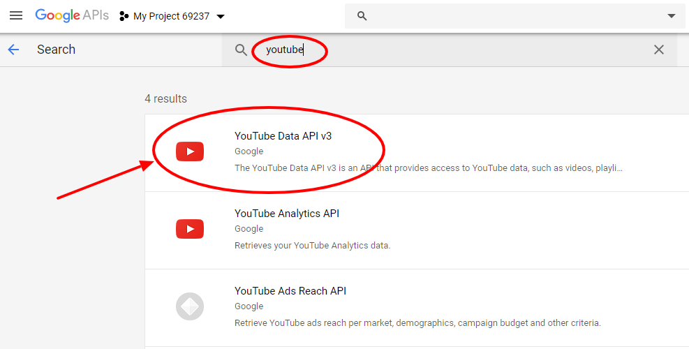
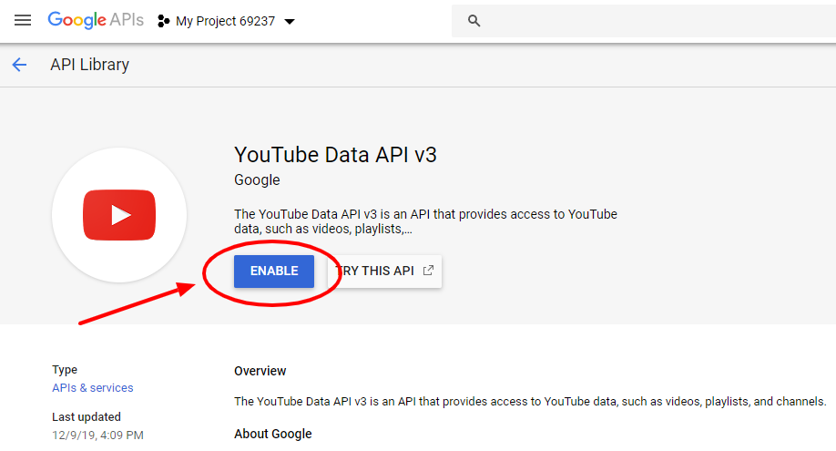
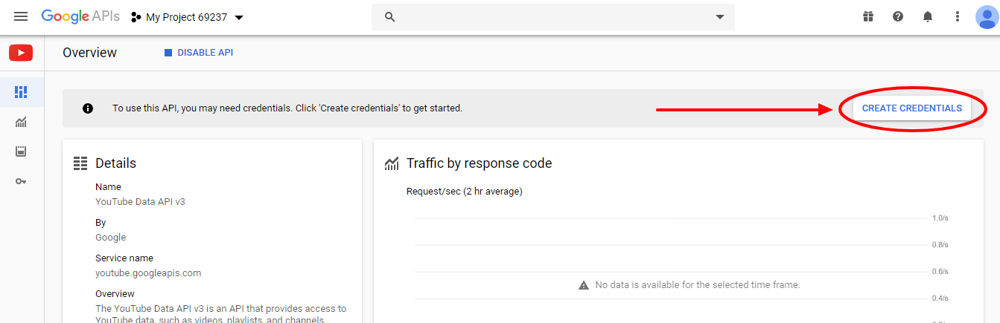
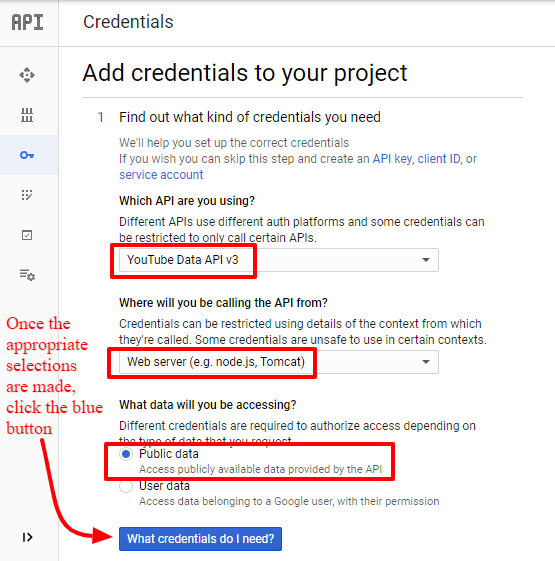
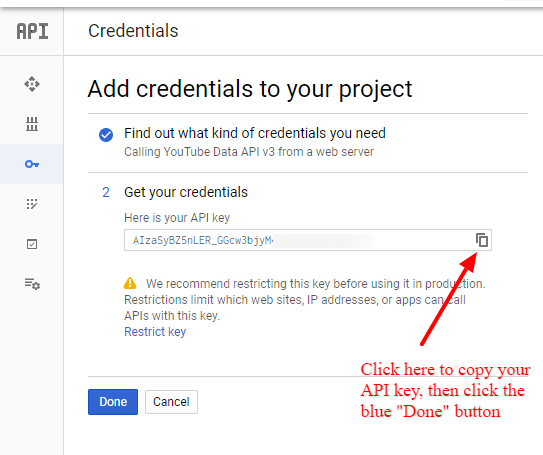

TubePress needs to regularly communicate with YouTube on your behalf. To sort out all the incoming requests, and for quota purposes, Google **mandates** that everyone supplies "API credentials" with each message. It's the rough equivalent of showing someone an ID card before you have a conversation.

Setting up your API credentials is easy, free, and should take less than 5 minutes.

1. Sign into the [Google Developer's Console](https://console.developers.google.com/). If you don’t already have a Google account, you will need to sign up for one.

1. Near the top left of the screen, there's a project-selection drop-down menu. If you don't have any projects (which will be the common case), this will say "Select a project".

    

1. Click that drop-down, then click the "New project" button in the ensuing popup window.

    

1. Give the project any name you want, then click the "create" button.

    

1. Wait a few seconds for the project to be created, then use the drop-down from Step 2 to select your new project

    

1. Click the blue "+ Enable APIs and Services" button near the top of the screen.

    

1. Type in "youtube" in the search box, then select “YouTube Data API v3” from the results.

    
    
    

1. Click the big "Enable" button on the ensuing page.

    

1. Click the "create credentials" button on the ensuing page.

    

1. In the form that shows up, select "YouTube Data API v3" in the first dropdown, "Web server (e.g. node.js, Tomcat)" in the second drop-down, then "Public data". Finally, click the "What credentials do I need?" button.

    

1. You'll be presented with a server key. Copy this key as shown below, then click the “Done” button.

    
